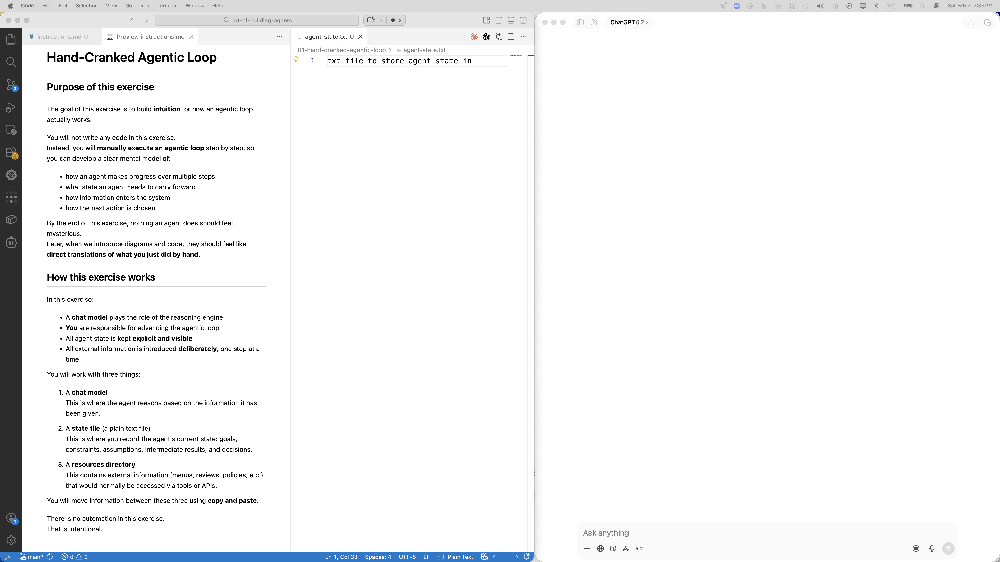

# Hand-Cranked Agentic Loop

## Purpose of this exercise

The goal of this exercise is to build **intuition** for how an agentic loop actually works.

You will not write any code in this exercise.  
Instead, you will **manually execute an agentic loop** step by step, so you can develop a clear mental model of:

- how an agent makes progress over multiple steps
- what state an agent needs to carry forward
- how information enters the system
- how the next action is chosen

By the end of this exercise, nothing an agent does should feel mysterious.  
Later, when we introduce diagrams and code, they should feel like **direct translations of what you just did by hand**.

## Setup

Before you begin, arrange your workspace so you can see everything at once.

Your screen should look roughly like this:



Arrange the windows as follows:

- On the **left**: `instructions.md` (this file), open in preview mode  
- In the **center**: the **agent state file** (plain text)  
- On the **right**: a **chat model**  
- Keep the **resources directory** easily accessible for copy/paste

You will move information between these using **copy and paste**.

There is no automation in this exercise.  That is intentional.

## Ground rules

Follow the steps in this file **exactly**, in order.

- Do not skip ahead
- Do not improvise
- Do not “help” the model by adding information early

For each iteration of the loop, you will:

- provide the model with the next piece of information
- observe the response
- update agent state and decide the next action

Keep this distinction clear:

- the **model reasons**
- **you** decide what happens next

No code, no tools — **you are the code and the tools**.

## Prompt template

For each turn in the exercise, you will paste a single prompt into the chat model using the following format.

- Treat **CONVERSATION HISTORY** as append-only (do not edit earlier entries).
- Put only the “thing to do now” in **CURRENT REQUEST**.
- If the model needs more information, it must ask using the `ASK:` format.

Copy/paste this template:

```text
===== RULES =====
You are a meeting planner agent helping organize a business dinner.
Use only the information explicitly provided below.
Do not use web browsing or external tools.
Do not assume missing information.
Ask for at most one missing item at a time using ASK.
When asking, request information by referencing one of the AVAILABLE CAPABILITIES.

===== AVAILABLE CAPABILITIES =====
- search_restaurants(neighborhood | distance):
  find restaurants based on location constraints

- get_restaurant_profile(restaurant_ids):
  get noise level and typical price per person

- get_menu_index(restaurant_ids):
  get links to restaurant menus (HTML or PDF)

Example:

ASK:
- search_restaurants(neighborhood=Downtown)

===== CONVERSATION HISTORY =====
<append-only history, oldest to newest>

===== CURRENT REQUEST =====
<the question or instruction the model should respond to now>
```

## Loop

### Iteration 0 - 


```text
===== RULES =====
You are a meeting planner agent helping organize a business dinner.
Use only the information explicitly provided below.
Do not use web browsing or external tools.
Do not assume missing information.
Ask for at most one missing item at a time using ASK.
When asking, request information by referencing one of the AVAILABLE CAPABILITIES.

===== AVAILABLE CAPABILITIES =====
- search_restaurants(neighborhood | distance):
  find restaurants based on location constraints

- get_restaurant_profile(restaurant_ids):
  get noise level and typical price per person

- get_menu_index(restaurant_ids):
  get links to restaurant menus (HTML or PDF)

- ask_user(question): 
  ask the human a question, the will answer the question in the next prompt
  

Example:

ASK:
- search_restaurants(neighborhood=Downtown)

===== CONVERSATION HISTORY =====


===== CURRENT REQUEST =====
I have a business dinner at 6 pm tonight for 4 people,
one of them is vegeration, I am at the office till 
5:30 pm and the dinner must stay within company expense policy. 
```