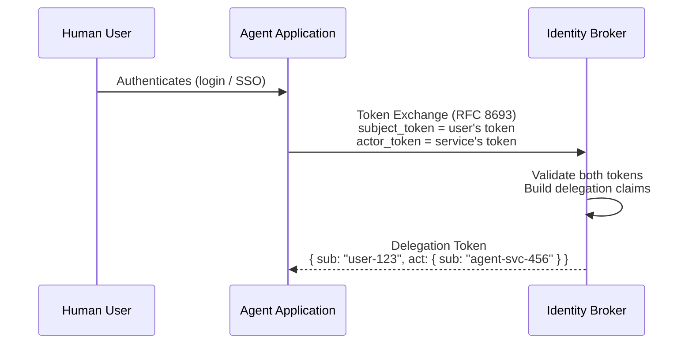
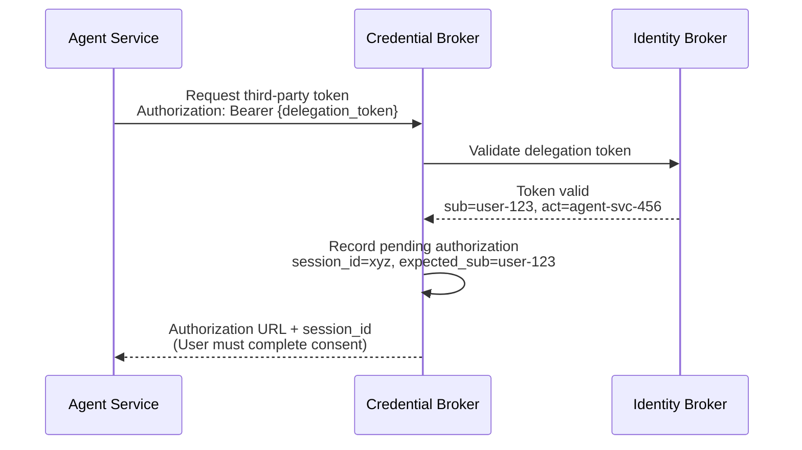
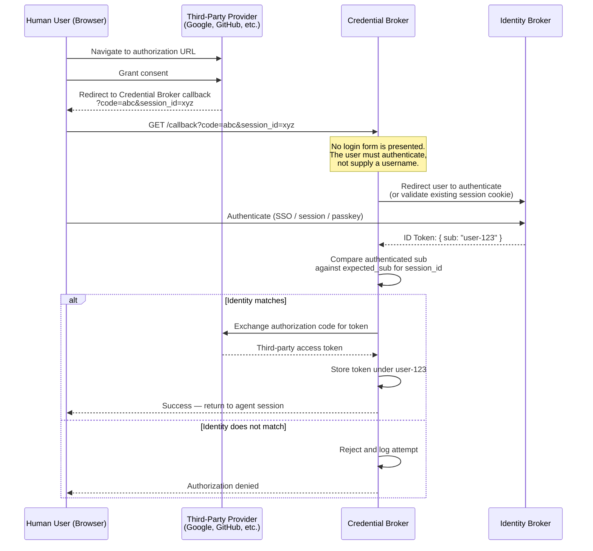
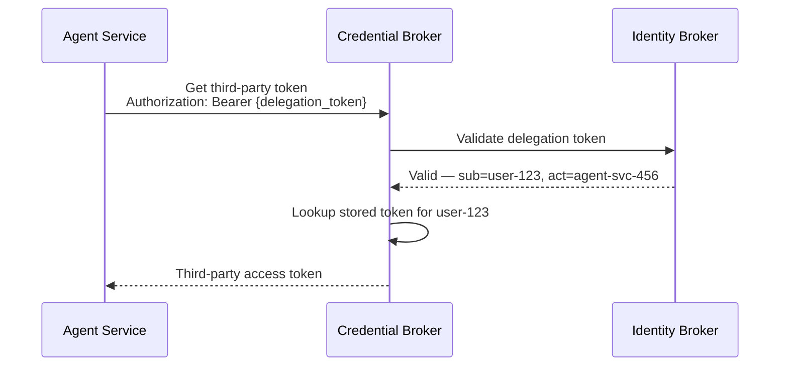
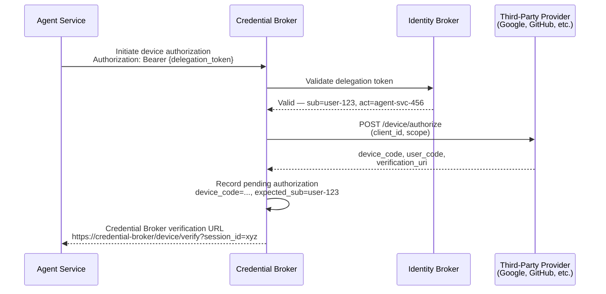
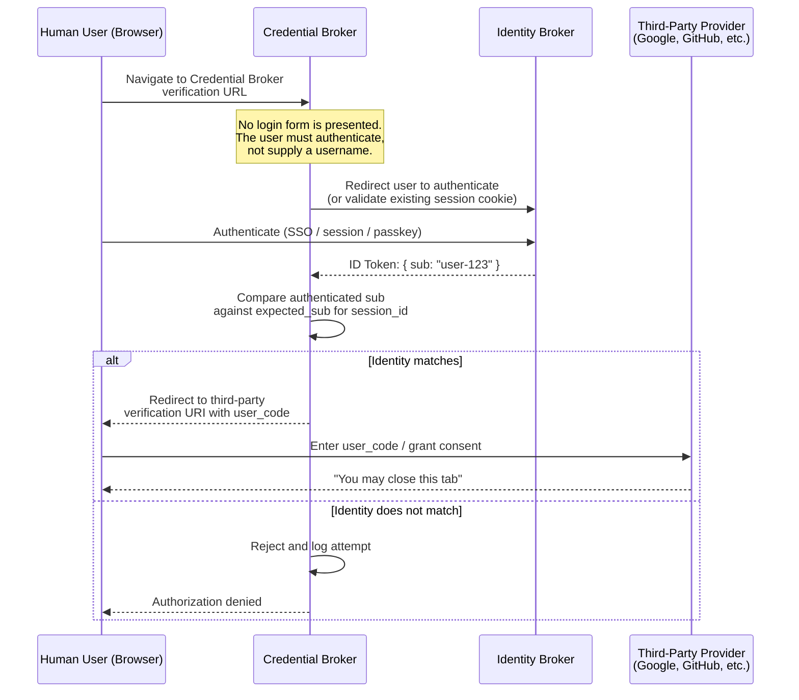
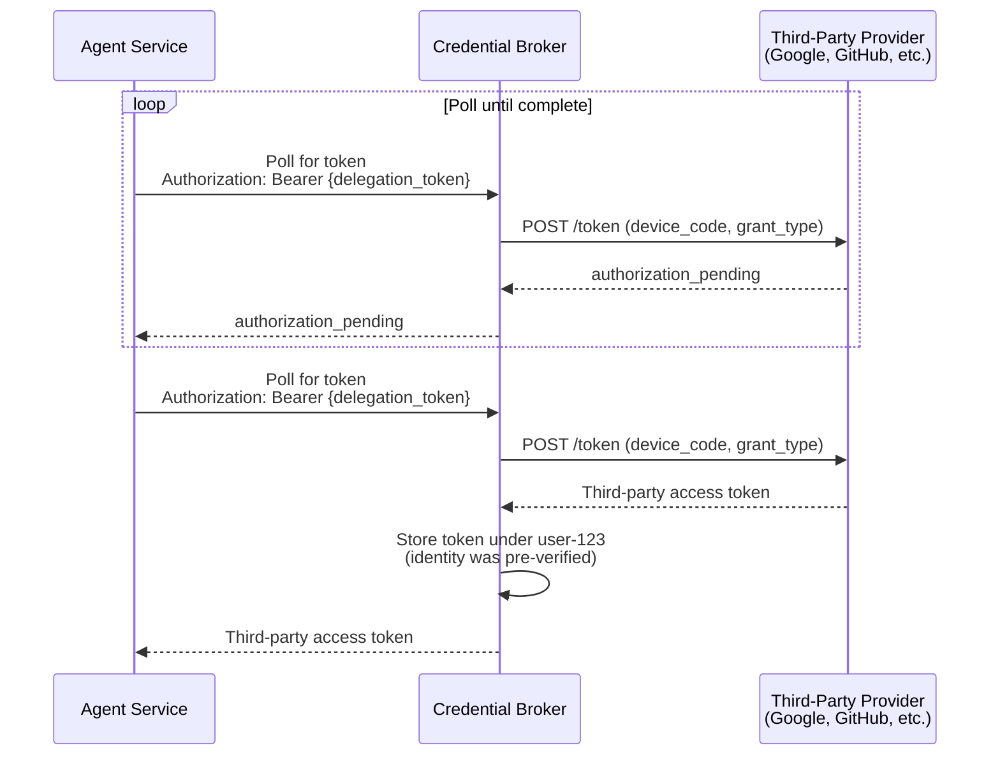

# Secure Credential Brokering for AI Agents

## The Problem: OAuth Authorization URL Forwarding

When an AI agent needs to access a third-party resource (e.g., Google Calendar) on behalf of a user, it initiates an OAuth authorization code flow. The authorization server returns an authorization URL that the user must visit to grant consent.

This creates a security gap: **the authorization URL is just a link**. If User A's agent generates the URL but User B clicks it and completes consent, the agent ends up with a token for User B's resource — stored under User A's identity. User A now has unauthorized access to User B's data.

This is a variant of the classic OAuth CSRF / session fixation problem, but unique to the agent context where the human-in-the-loop consent step creates an opportunity for the wrong human to complete it.

The same class of vulnerability exists in the **Device Authorization Grant** (RFC 8628). The `user_code` and `verification_uri` can be shared — intentionally or accidentally — and nothing in the protocol binds the initiating user to the consenting user.

## Architecture Overview

This design closes the security gap using two cooperating services and the RFC 8693 Token Exchange delegation pattern.

| Service | Role |
|---------|------|
| **Identity Broker** | Authorization server that issues access and ID tokens. Supports token exchange (RFC 8693) to produce delegation tokens that encode both the human subject and the acting service. |
| **Credential Broker** | Service responsible for retrieving and storing third-party OAuth tokens on behalf of users. Only accepts delegation tokens issued by the Identity Broker. |

The key insight is that the Credential Broker never trusts a bare service token or user-supplied identity. It requires a **delegation token** that cryptographically binds the human user's identity to the calling agent service — and it independently verifies the user's identity at the consent callback.

## Flow 1: Obtaining a Delegation Token

Before the agent can request third-party credentials, it must obtain a delegation token from the Identity Broker via token exchange. This token encodes *who* the human is and *which* service is acting on their behalf.



The resulting delegation token contains an `act` claim per RFC 8693:

```json
{
  "sub": "user-123",
  "act": {
    "sub": "agent-svc-456"
  },
  "iss": "https://identity-broker.example.com",
  "aud": "https://credential-broker.example.com",
  "exp": 1719500000
}
```

The agent cannot forge this token. It had to present a valid user token — one that the user obtained by authenticating directly with the Identity Broker — to receive it.

## Flow 2: Initiating Third-Party Authorization

When the agent needs access to a third-party resource, it calls the Credential Broker with its delegation token. The Credential Broker generates an authorization URL and records the expected user identity.



At this point the Credential Broker knows exactly which user should complete the consent flow. This is the critical state that enables verification later.

## Flow 3: User Consent and Session Binding

The user navigates to the authorization URL, consents at the third-party provider, and is redirected back to the Credential Broker's callback endpoint. Here is where the security binding happens.



The Credential Broker **forces authentication** at the callback. It redirects the user to the Identity Broker (or checks an existing session cookie from the Identity Broker). The user cannot type in a username — their identity comes from the authentication protocol. This is the mechanism that prevents a different user from completing someone else's consent flow.

## Flow 4: Agent Retrieves the Token

Once consent is complete and verified, the agent can retrieve the third-party token using the same delegation token.



The delegation token ensures the agent can only retrieve tokens belonging to the user encoded in its `sub` claim. Even if another agent or service intercepts the flow, they would need a delegation token with a matching `sub` to access the stored credential.

## Flow 5: Device Flow Variant — Pre-Consent Identity Binding

The OAuth Device Authorization Grant (RFC 8628) presents a different challenge. There is no redirect callback after the user grants consent at the third-party provider — the user simply completes consent in their browser and the agent polls the token endpoint on the backend. This eliminates the callback-based verification point used in the authorization code flow.

To maintain the same security guarantees, the Credential Broker is inserted **before** the user reaches the third-party provider. The user lands on the Credential Broker first, authenticates, and is then forwarded to the provider's verification URI. This establishes a verified identity before consent is granted rather than after.

### Step 1: Agent Initiates Device Flow via Credential Broker



The agent receives a Credential Broker URL — not the third-party provider's verification URI directly. This ensures the user must pass through the Credential Broker before reaching the provider.

### Step 2: User Authenticates at Credential Broker, Then Completes Consent



The Credential Broker forces authentication before the user ever reaches the third-party provider. If User B clicks User A's verification link, User B authenticates as User B, the Credential Broker detects the mismatch, and the flow is terminated. User B never reaches the consent page.

### Step 3: Agent Polls and Credential Broker Stores the Token



Because the user's identity was verified *before* consent, the Credential Broker can safely store the token when the poll succeeds. The agent retrieves the token through the same delegation-token-scoped path as in the authorization code flow.

### Why Pre-Consent Binding Is Necessary for the Device Flow

In the authorization code flow, the Credential Broker verifies identity at the callback — *after* consent. This works because the callback gives the Credential Broker a browser interaction point where it can force authentication.

The device flow has no such callback. The user completes consent entirely on the third-party provider's site and the token arrives via backend polling. By inserting the Credential Broker *before* the provider, the design creates an equivalent verification point. The user cannot reach the consent page without first proving their identity to the Credential Broker.

This approach also has a secondary benefit: **the attack is blocked earlier**. In the authorization code flow, User B completes consent at the provider before being rejected at the callback. In the device flow variant, User B is rejected before ever reaching the provider — consent never happens, and no authorization code or token is ever issued.

## How the Security Gap Is Closed

The authorization URL forwarding attack fails at two independent enforcement points:

### Enforcement Point 1: Callback Authentication

When User B clicks User A's authorization URL and completes consent at the third-party provider, the browser redirects to the Credential Broker's callback. The Credential Broker does not accept a username — it forces authentication via the Identity Broker. User B authenticates as User B. The Credential Broker compares this against the expected identity (User A) recorded when the flow was initiated, finds a mismatch, and rejects the request. **User B's third-party token is never stored.**

### Enforcement Point 2: Delegation Token Binding on Retrieval

Even if the callback verification were somehow bypassed and a token were stored under the wrong identity, the retrieval path provides a second layer of defense. The agent must present a delegation token to fetch credentials. The Credential Broker validates the token with the Identity Broker and uses the `sub` claim — not any user-supplied value — to scope the lookup. An agent acting on behalf of User A can only retrieve User A's tokens.

### Why This Is Stronger Than Application-Level Session Checks

Some platforms (such as AWS Bedrock AgentCore) address this problem by delegating user verification to the application's callback endpoint. The application must check its own session state and call a completion API if the user matches.

This design improves on that approach in several ways:

- **The Credential Broker is the enforcement point**, not the application. There is no reliance on the application correctly implementing session verification.
- **Identity is established cryptographically** via tokens issued by the Identity Broker, not by inspecting application cookies or session stores.
- **The delegation token creates an unbroken chain of trust**: Human authenticates → Identity Broker issues user token → Token exchange produces delegation token with both subjects → Credential Broker validates the delegation token. No step in this chain relies on user input or application-level state.
- **No username or identity field is ever accepted from the user at the callback.** Authentication is the only path to establishing identity, eliminating an entire class of input-based attacks.

## Summary

| Threat | Mitigation |
|--------|------------|
| User A's authorization URL is forwarded to User B | Callback forces authentication; User B's identity does not match expected identity → rejected |
| Device flow verification link is forwarded to User B | Pre-consent authentication at Credential Broker blocks User B before they reach the third-party provider |
| Agent service attempts to retrieve another user's token | Delegation token's `sub` claim scopes retrieval; cannot be forged without a valid user token |
| Malicious service impersonates the agent | Delegation token's `act` claim identifies the service; Identity Broker validates the actor token |
| Application fails to verify session at callback | Verification is performed by the Credential Broker itself, not delegated to the application |
| User types in a different username at callback | No username input is accepted; identity comes from authentication only |