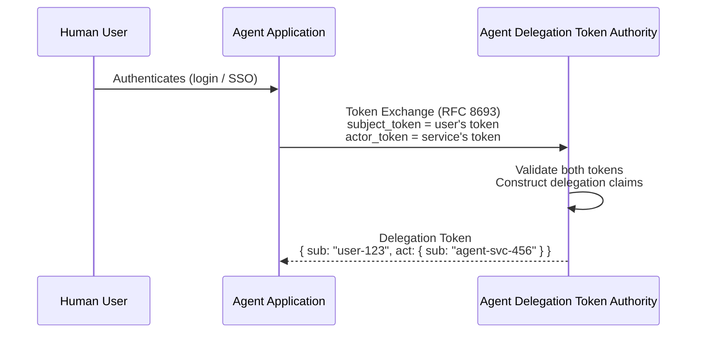
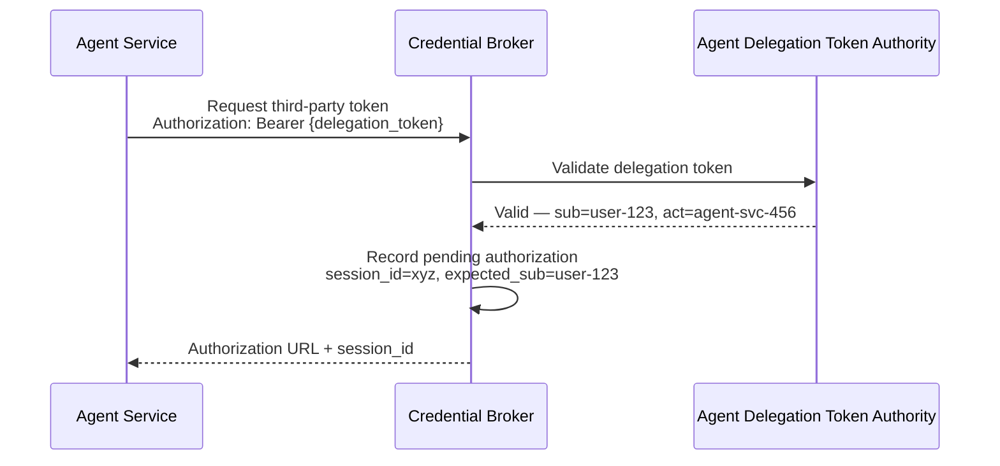
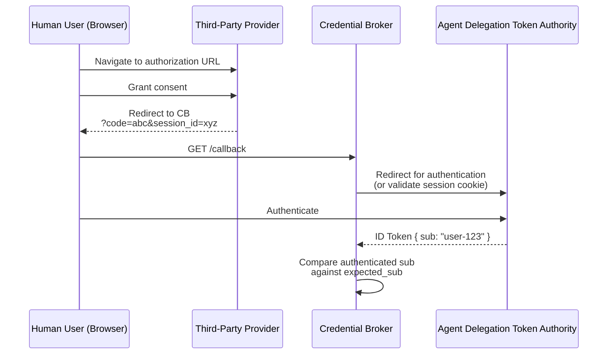
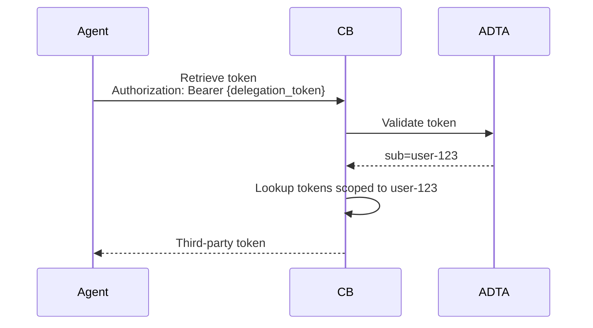
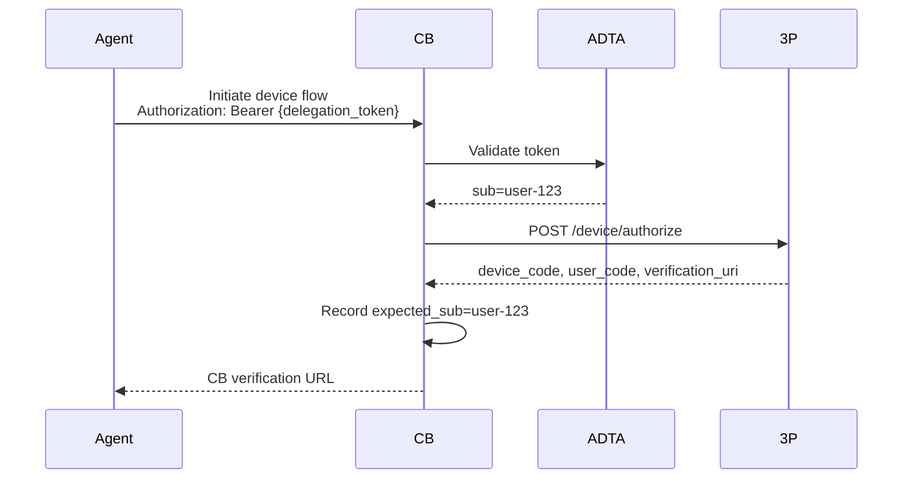
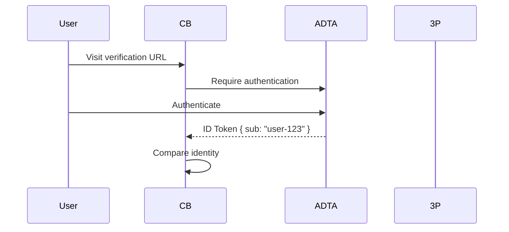

# Secure Credential Brokering for AI Agents

## The Problem: OAuth Authorization URL Forwarding

When an AI agent needs to access a third-party resource (e.g., Google Calendar) on behalf of a user, it initiates an OAuth authorization flow. The authorization server returns a URL that a human must visit to grant consent.

That URL is just a link.

If User A’s agent generates the authorization URL but User B clicks it and completes consent, the agent can end up holding a token for User B — but storing it under User A’s identity.

User A now has unauthorized access to User B’s data.

This is a variant of the classic OAuth CSRF/session fixation class of issues, but amplified in the agent context because:

- There is a human-in-the-loop consent step.
- The agent is operating on behalf of a user.
- The consent step can be completed by the wrong human.

The same class of vulnerability exists in the **Device Authorization Grant** (RFC 8628). The `user_code` and `verification_uri` are shareable. Nothing in the base protocol binds the initiating user to the consenting user.

We must close this gap.

---

## Architecture Overview

This design closes the gap using two cooperating services and the RFC 8693 token exchange delegation model.

| Service | Role |
|----------|------|
| **Agent Delegation Token Authority** | Authorization server responsible for issuing access and ID tokens. Supports RFC 8693 token exchange to produce delegation tokens that encode both the human subject and the acting service. |
| **Credential Broker** | Responsible for retrieving and storing third-party OAuth credentials on behalf of users. Only accepts delegation tokens issued by the Agent Delegation Token Authority. |

### Key Design Principle

The Credential Broker never trusts:

- A bare service token
- A user-supplied identity
- An application session

It requires a **delegation token** that cryptographically binds:

- The human user (`sub`)
- The acting service (`act.sub`)

And it independently verifies the human identity during consent completion.

---

## Flow 1: Obtaining a Delegation Token

Before the agent can request third-party credentials, it must obtain a delegation token via RFC 8693 token exchange.



Example delegation token:

```json
{
  "sub": "user-123",
  "act": {
    "sub": "agent-svc-456"
  },
  "iss": "https://agent-delegation-token-authority.example.com",
  "aud": "https://credential-broker.example.com",
  "exp": 1719500000
}
```

This token cannot be forged. The agent had to present:

- A valid user token (obtained via real authentication)
- A valid service credential

The result is a cryptographically bound user-service pair.

---

## Flow 2: Initiating Third-Party Authorization (Authorization Code Flow)

When the agent needs a third-party credential:



The Credential Broker now has:

- The expected user identity
- A bound session
- A verified acting service

This state is what enables secure enforcement later.

---

## Flow 3: Callback Enforcement and Identity Binding

The user completes consent at the third-party provider and is redirected back.



### Enforcement

If identities match:
- Exchange authorization code
- Store token under `user-123`

If identities do not match:
- Reject
- Log
- Do not store token

No username input is ever accepted.

Identity is derived exclusively from authentication.

---

## Flow 4: Retrieval Is Delegation-Scoped

When the agent retrieves the stored token:



The lookup is scoped strictly by the `sub` claim.

Even if another service intercepts the flow, without a matching delegation token it cannot retrieve the stored credential.

---

# Device Flow Variant — Pre-Consent Identity Binding

The Device Authorization Grant (RFC 8628) removes the callback verification opportunity. The user completes consent at the provider, and the backend polls.

To preserve equivalent guarantees, the Credential Broker inserts itself **before** the provider.

---

## Step 1: Agent Initiates Device Flow



The agent never exposes the provider’s verification URI directly.

---

## Step 2: Pre-Consent Authentication



If identity matches:
- Redirect to provider verification URI with `user_code`

If mismatch:
- Reject before consent

This blocks the attack earlier than the authorization code flow.

The user never reaches the provider unless identity is verified.

---

## Step 3: Polling and Storage

When polling succeeds:

- Credential Broker stores token under verified `sub`
- Agent retrieves it using delegation token

Identity was verified before consent, so storage is safe.

---

# How the Security Gap Is Closed

There are two independent enforcement layers.

## 1. Authentication-Bound Callback (or Pre-Consent Verification)

A human cannot complete someone else’s flow because:

- Authentication is forced
- Identity is derived from a token
- It must match the originally expected `sub`

No user input determines identity.

## 2. Delegation Token Binding on Retrieval

Credential retrieval requires:

- A valid delegation token
- Proper `sub`
- Valid `act` (service identity)

Even if storage were compromised, retrieval is cryptographically scoped.

---

# Why This Is Stronger Than Application-Level Session Checks

Some systems (e.g., **AWS Bedrock AgentCore**) rely on the application to verify session identity at callback.

This design centralizes enforcement:

- The Credential Broker is the enforcement point.
- Identity comes from signed tokens.
- RFC 8693 delegation creates an explicit chain:
  
  Human → User Token → Token Exchange → Delegation Token → Credential Broker

No step relies on cookies or user-supplied identity fields.

---

# Threat Model Summary

| Threat | Mitigation |
|----------|------------|
| Authorization URL forwarded to wrong user | Forced authentication at callback → identity mismatch → rejected |
| Device verification link forwarded | Pre-consent authentication at Credential Broker blocks mismatch |
| Agent retrieves another user’s token | Delegation token `sub` scopes lookup |
| Malicious service impersonates agent | `act` claim validated by Agent Delegation Token Authority |
| Application forgets session validation | Enforcement occurs in Credential Broker |
| User types different username | No username input accepted; identity derived from authentication |

---

# Summary

The core idea is simple:

- Bind user identity to service identity cryptographically.
- Enforce identity at consent completion.
- Scope retrieval to delegation tokens.
- Never trust user input for identity.
- Centralize enforcement in infrastructure.

The **Agent Delegation Token Authority** establishes cryptographic delegation.

The **Credential Broker** enforces identity binding and credential isolation.

Together, they eliminate the authorization URL forwarding class of vulnerabilities in both authorization code and device flows — without relying on application-level session correctness.
