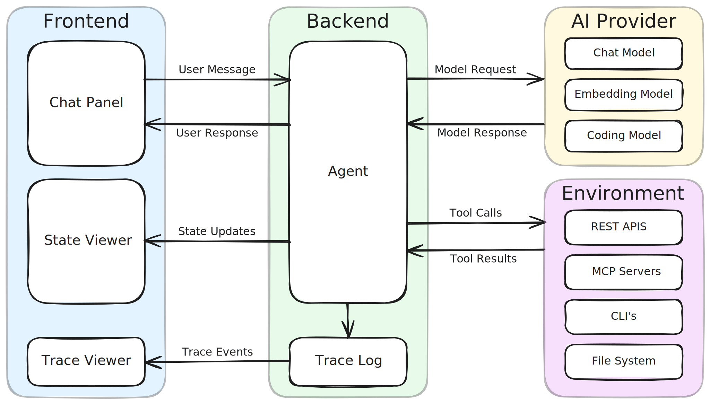

# Building an Agent, One Layer at a Time

This workshop begins with a working scaffold for exploring AI agents. That scaffold remains in place for the entire workshop and evolves with us. The objective is to develop a precise, operational mental model of how an agent emerges through incremental, layered design.

The frontend provides three surfaces. The Chat Panel is where we interact with the agent. The State Viewer exposes the agent’s internal state. The Trace Viewer shows the execution events generated as the agent runs. From the beginning, interaction, state, and execution are visible.

On the backend, we run a Spring application that contains an Agent and a Trace Log. In the first sample, the Agent is intentionally minimal — the backend calls a chat model and returns the response. This baseline gives us a clear starting point.

Each new section explores a different aspect of building an agent. The scaffold does not change. The UI remains the same. The state and trace viewers remain in place. What evolves is the architecture of the Agent inside the backend. Because the interaction and inspection surfaces stay stable, we can see exactly how each capability alters the system.
