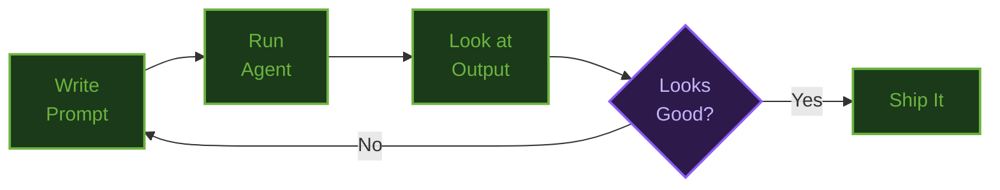

# The Art of Building Agents

## Record · Structure · Eval · Analyze

**Mark Pollack**

Spring I/O Barcelona 2026

<div class="abs-br m-6 flex gap-2">
  <a href="https://github.com/spring-ai-community/art-of-building-agents" target="_blank" class="slidev-icon-btn">
    <carbon:logo-github />
  </a>
</div>

<!--
SPEAKER (≈20s):
"You've seen how to build an agent — ChatClient, tools, advisors, sub-agents. Now I'm going to show you what happens AFTER you build it. Because building is the easy part. Knowing whether it actually works — that's what nobody does."
-->

---
layout: center
class: text-center bg-black
---

<div class="text-5xl font-bold text-white">
Everyone builds agents.
</div>

<v-click>

<div class="text-5xl font-bold text-gradient mt-8">
Nobody measures them.
</div>

</v-click>

<!--
SPEAKER (≈15s):
"Here's the problem. Building an agent is the easy part. Knowing whether it actually works — that's what nobody does."
(CLICK: reveal "Nobody measures them.")
-->

---
layout: default
---

# The Vibe Coding Loop

<div class="mt-4 text-lg opacity-80 mb-4">How most of us build agents today:</div>



<v-click>

<div class="mt-4 p-3 rounded-lg" style="background: rgba(245, 158, 11, 0.08); border-left: 4px solid #f59e0b;">
<div class="text-lg">The "Looks Good?" step is <strong style="color: #f59e0b;">you</strong>. Your eyes. Your judgment. Your time.</div>
</div>

</v-click>

<!--
SPEAKER (≈30s):
"This is the loop everyone is in. Write a prompt. Run the agent. Look at the output. Does it look good? No — tweak the prompt. Yes — ship it. The critical step is 'looks good?' — and that step is YOU. You are the feedback loop."
-->

---
layout: default
---

# It Works at Small Scale

<div class="grid grid-cols-3 gap-6 mt-8">

<div v-click class="p-4 rounded-lg text-center" style="background: rgba(109, 179, 63, 0.1); border: 2px solid rgba(109, 179, 63, 0.3);">
<div class="text-4xl font-bold" style="color: #6DB33F;">1 query</div>
<div class="text-lg opacity-80 mt-2">Fine</div>
<div class="text-sm opacity-50 mt-1">You read the output</div>
</div>

<div v-click class="p-4 rounded-lg text-center" style="background: rgba(245, 158, 11, 0.1); border: 2px solid rgba(245, 158, 11, 0.3);">
<div class="text-4xl font-bold" style="color: #f59e0b;">10 queries</div>
<div class="text-lg opacity-80 mt-2">Tedious</div>
<div class="text-sm opacity-50 mt-1">You skim the output</div>
</div>

<div v-click class="p-4 rounded-lg text-center" style="background: rgba(239, 68, 68, 0.1); border: 2px solid rgba(239, 68, 68, 0.3);">
<div class="text-4xl font-bold" style="color: #ef4444;">100 queries</div>
<div class="text-lg opacity-80 mt-2">Impossible</div>
<div class="text-sm opacity-50 mt-1">You trust and hope</div>
</div>

</div>

<v-click>

<div class="mt-6 p-3 rounded-lg" style="background: rgba(239, 68, 68, 0.08); border-left: 4px solid #ef4444;">
<div class="text-lg"><strong style="color: #ef4444;">Jarvis recommends Tickets Bar at €75/person on a €50 budget.</strong> If you're not reading every response, you won't catch it.</div>
</div>

</v-click>

<!--
SPEAKER (≈30s):
"One query — fine, you read the output. Ten queries — tedious, you start skimming. A hundred queries — you trust and hope. And that's where Jarvis recommends Tickets Bar at 75 euros on a 50 euro budget. If you're not reading every response, you won't catch it."
-->

---
layout: center
class: text-center
---

<div class="text-5xl font-bold" style="color: #f59e0b;">
Who is the judge?
</div>

<v-click>

<div class="text-2xl opacity-70 mt-8">
Something must take your place.
</div>

</v-click>

<!--
SPEAKER (≈10s):
"So the question becomes..." [PAUSE] "Who is the judge?" [PAUSE 2 seconds]
-->

---
layout: default
---

# This Is Not Observability

<div class="grid grid-cols-2 gap-8 mt-8">

<div class="p-5 rounded-lg" style="background: rgba(255, 255, 255, 0.03); border: 2px solid rgba(255, 255, 255, 0.15);">
<div class="text-2xl font-bold opacity-40">Observability</div>
<div class="mt-4 opacity-50">

* Uptime
* Latency
* Errors
* Traces

</div>
<div class="mt-4 text-lg opacity-40">"Is the system healthy?"</div>
</div>

<div class="p-5 rounded-lg" style="background: rgba(109, 179, 63, 0.08); border: 2px solid rgba(109, 179, 63, 0.3);">
<div class="text-2xl font-bold" style="color: #6DB33F;">Agent Feedback</div>
<div class="mt-4">

* **Correctness** (judge)
* **Behavior** (journal)

</div>
<div class="mt-4 text-lg">"Is the agent right? Why did it behave this way?"</div>
</div>

</div>

<v-click>

<div class="mt-6 p-3 rounded-lg" style="background: rgba(109, 179, 63, 0.05); border-left: 4px solid #6DB33F;">
<div class="text-xl"><strong>Observability keeps systems running. Feedback systems make agents better.</strong></div>
</div>

</v-click>

<!--
SPEAKER (≈30s):
"This is NOT observability. Observability tells you if the system is healthy. That's table stakes. Agent feedback tells you if the agent is CORRECT and WHY it behaved the way it did. Different category."
-->

---
layout: default
---

# Feedback Systems

<div class="grid grid-cols-2 gap-8 mt-8">

<div class="p-6 rounded-lg" style="background: rgba(59, 130, 246, 0.08); border: 2px solid rgba(59, 130, 246, 0.3);">
<div class="text-2xl font-bold" style="color: #3b82f6;">Judge</div>
<div class="text-sm opacity-50 mt-1">OUTCOME-ORIENTED</div>
<div class="text-lg opacity-80 mt-4">"Did Jarvis pick the right restaurant?"</div>
<div class="text-base opacity-60 mt-2">Price within budget? Dietary met? Good reasoning?</div>
</div>

<div class="p-6 rounded-lg" style="background: rgba(245, 158, 11, 0.08); border: 2px solid rgba(245, 158, 11, 0.3);">
<div class="text-2xl font-bold" style="color: #f59e0b;">Journal</div>
<div class="text-sm opacity-50 mt-1">BEHAVIOR-ORIENTED</div>
<div class="text-lg opacity-80 mt-4">"How did Jarvis get there?"</div>
<div class="text-base opacity-60 mt-2">Tool calls, loops, decisions, timing</div>
</div>

</div>

<v-click>

<div class="mt-6 p-3 rounded-lg" style="background: rgba(109, 179, 63, 0.05); border-left: 4px solid #6DB33F;">
<div class="text-xl"><strong>Judges tell you if the agent is right. Journals tell you why it behaves the way it does.</strong></div>
</div>

</v-click>

<!--
SPEAKER (≈30s):
"Two types of feedback. Judges are outcome-oriented — did Jarvis pick the right restaurant? Journals are behavior-oriented — how did it GET there? Which tools did it call? Did it loop? You need both."
-->

---
layout: default
---

# The Developer Lifecycle

<div class="mt-8 grid grid-cols-5 gap-3 text-center">
  <div class="lifecycle-dim">
    <div class="text-2xl font-bold">Build</div>
    <div class="text-sm mt-1 opacity-75">Steps 01-12</div>
  </div>
  <div class="lifecycle-dim">
    <div class="text-2xl font-bold">Test</div>
    <div class="text-sm mt-1 opacity-75">Everyone stops here</div>
  </div>
  <div class="lifecycle-active">
    <div class="text-2xl font-bold">Eval</div>
    <div class="text-sm mt-1 opacity-75">Step 14</div>
  </div>
  <div class="lifecycle-active">
    <div class="text-2xl font-bold">Analyze</div>
    <div class="text-sm mt-1 opacity-75">Step 15</div>
  </div>
  <div class="lifecycle-active">
    <div class="text-2xl font-bold">Improve</div>
    <div class="text-sm mt-1 opacity-75">Step 16</div>
  </div>
</div>

<v-click>

<div class="mt-10 ted-emphasis">
Build and Test are table stakes. <strong>Eval</strong>, <strong>Analyze</strong>, and <strong>Improve</strong> are where the ROI compounds.
</div>

</v-click>

<!--
SPEAKER (≈30s):
"This is the developer lifecycle for agents. Everyone does Build. Some teams get to Test. Almost nobody goes further. Today we go from Eval to Improve — and that's where agents start getting better on their own."
-->

---
layout: default
---

# Four Steps — One Progression

<div class="mt-6 grid grid-cols-4 gap-4 text-center">
  <div class="p-4 rounded-lg border-2 border-blue-500 bg-blue-900/30">
    <div class="text-2xl font-bold">05</div>
    <div class="text-lg mt-1">Journal</div>
    <div class="text-xs mt-2 opacity-75">Record everything</div>
  </div>
  <div class="p-4 rounded-lg border-2 border-green-500 bg-green-900/30">
    <div class="text-2xl font-bold">13</div>
    <div class="text-lg mt-1">Workflow</div>
    <div class="text-xs mt-2 opacity-75">Structure execution</div>
  </div>
  <div class="p-4 rounded-lg border-2 border-purple-500 bg-purple-900/30">
    <div class="text-2xl font-bold">14</div>
    <div class="text-lg mt-1">Judge</div>
    <div class="text-xs mt-2 opacity-75">Evaluate output</div>
  </div>
  <div class="p-4 rounded-lg border-2 border-orange-500 bg-orange-900/30">
    <div class="text-2xl font-bold">15</div>
    <div class="text-lg mt-1">Diagnose</div>
    <div class="text-xs mt-2 opacity-75">Record + analyze behavior</div>
  </div>
</div>

<v-click>

<div class="mt-6 text-center">

| Step | You gain | Without it |
|------|----------|------------|
| Journal | Visibility | Flying blind |
| Workflow | Determinism | Hoping the prompt works |
| Judge | Verification | Silent failures ship |
| Diagnose | Diagnosis | Failures stay opaque |

</div>

</v-click>

<!--
SPEAKER (≈30s):
"Four steps."
[CLICK: reveal table]
"Journal gives you visibility — without it, you're flying blind. Workflow gives you determinism — without it, you're hoping the prompt works. Judge gives you verification — without it, silent failures ship. Diagnose gives you diagnosis — without it, failures stay opaque."
-->

---
layout: default
---

# The Tech Stack

<div class="mt-6 space-y-4">

<div class="p-4 rounded-lg" style="background: rgba(109, 179, 63, 0.08); border: 2px solid rgba(109, 179, 63, 0.3);">
<div class="text-xl font-bold" style="color: #6DB33F;">Spring AI ChatClient</div>
<div class="text-base opacity-80 mt-2">All LLM calls go through <code>ChatClient.prompt().call()</code> — Spring AI's fluent API</div>
</div>

<div class="grid grid-cols-3 gap-4">

<div class="p-3 rounded-lg" style="background: rgba(59, 130, 246, 0.08); border: 1px solid rgba(59, 130, 246, 0.3);">
<div class="text-sm font-bold" style="color: #3b82f6;">AgentLoopAdvisor</div>
<div class="text-xs opacity-70 mt-1">ChatClient advisor that manages the multi-turn tool-calling loop (max turns, listener hooks)</div>
<div class="text-xs opacity-50 mt-1">agent-workflow library</div>
</div>

<div class="p-3 rounded-lg" style="background: rgba(139, 92, 246, 0.08); border: 1px solid rgba(139, 92, 246, 0.3);">
<div class="text-sm font-bold" style="color: #8b5cf6;">Workflow DSL</div>
<div class="text-xs opacity-70 mt-1">Type-safe step composition: <code>Workflow.define().step().step().run()</code></div>
<div class="text-xs opacity-50 mt-1">agent-workflow library</div>
</div>

<div class="p-3 rounded-lg" style="background: rgba(245, 158, 11, 0.08); border: 1px solid rgba(245, 158, 11, 0.3);">
<div class="text-sm font-bold" style="color: #f59e0b;">CascadedJury</div>
<div class="text-xs opacity-70 mt-1">Tiered evaluation: deterministic checks first, LLM only if needed</div>
<div class="text-xs opacity-50 mt-1">spring-ai-agent-judge library</div>
</div>

</div>

</div>

<v-click>

<div class="mt-4 p-3 rounded-lg" style="background: rgba(109, 179, 63, 0.05); border-left: 4px solid #6DB33F;">
<div class="text-base"><strong>@Tool</strong> methods are Spring AI annotations. <strong>ChatClient</strong> is Spring AI. The loop management, workflow DSL, and judge framework are community libraries on top.</div>
</div>

</v-click>

<!--
SPEAKER (≈20s):
"Quick orientation on the stack. All LLM calls go through Spring AI's ChatClient. AgentLoopAdvisor manages the multi-turn tool loop — it's a ChatClient advisor. The Workflow DSL composes typed steps. CascadedJury evaluates outputs. All community libraries layered on Spring AI."
[CLICK: reveal note]
"@Tool, ChatClient — that's Spring AI. Everything else layers on top."
-->

---
layout: center
class: text-center
---

<div class="text-sm tracking-widest uppercase opacity-50 mb-4" style="color: #6DB33F;">
Step 05
</div>

# Journal

<div class="text-3xl mt-8 opacity-75">
The seam between Build and Measure
</div>

<v-click>

<div class="mt-6 p-3 rounded-lg text-lg" style="background: rgba(59, 130, 246, 0.08); border: 1px solid rgba(59, 130, 246, 0.3);">
Same free-form agent as Steps 01–04. Same tools, same prompt.<br/>
<strong style="color: #3b82f6;">Only change: we add recording.</strong>
</div>

</v-click>

<!--
SPEAKER (≈15s):
"Step 05 is where we start recording. The agent is identical — same ChatClient, same tools, same AgentLoopAdvisor. The LLM still decides everything. We're just adding visibility."
[CLICK: reveal "only change"]
"No control. Just recording. Without recording, you can't measure."
-->

---
layout: default
---

# Logs vs Journal

<div class="grid grid-cols-2 gap-6 mt-8">

<div class="p-4 rounded-lg" style="background: rgba(239, 68, 68, 0.08); border: 2px solid rgba(239, 68, 68, 0.3);">
<div class="text-xl font-bold" style="color: #ef4444;">Logs</div>
<div class="text-base opacity-80 mt-2">Unstructured text</div>
<div class="text-base opacity-80">Written for debugging</div>
<div class="text-base opacity-80">Grep and hope</div>
<div class="mt-3 text-sm opacity-50">History</div>
</div>

<div class="p-4 rounded-lg" style="background: rgba(109, 179, 63, 0.08); border: 2px solid rgba(109, 179, 63, 0.3);">
<div class="text-xl font-bold" style="color: #6DB33F;">Journal</div>
<div class="text-base opacity-80 mt-2">Structured events per turn</div>
<div class="text-base opacity-80">Written for measurement</div>
<div class="text-base opacity-80">Query, aggregate, compare</div>
<div class="mt-3 text-sm opacity-50">Measurement</div>
</div>

</div>

<v-click>

<div class="mt-6 p-3 rounded-lg" style="background: rgba(245, 158, 11, 0.08); border-left: 4px solid #f59e0b;">
<div class="text-xl"><strong style="color: #f59e0b;">Logs are history. Journal is evaluation.</strong> The journal data feeds everything downstream — trajectory analysis, cost tracking, eval scoring.</div>
</div>

</v-click>

<!--
SPEAKER (≈20s):
"This isn't logging. Logging is unstructured text written for debugging. Journal is structured measurement — typed events, per turn, queryable. The journal data feeds everything in Steps 14 and 15."
-->

---
layout: default
---

# What is Journal.run()?

<div class="grid grid-cols-2 gap-6 mt-6">

<div class="p-5 rounded-lg" style="background: rgba(245, 158, 11, 0.08); border: 2px solid rgba(245, 158, 11, 0.3);">
<div class="text-xl font-bold" style="color: #f59e0b;">W&B analogy</div>
<div class="mt-3 text-base opacity-80">

`Journal.run()` is like **`wandb.init()`** — it opens a recording scope for an experiment run

</div>
<div class="text-sm opacity-60 mt-2">Everything inside the scope is recorded. When it closes, the run is finalized.</div>
</div>

<div class="p-5 rounded-lg" style="background: rgba(59, 130, 246, 0.08); border: 2px solid rgba(59, 130, 246, 0.3);">
<div class="text-xl font-bold" style="color: #3b82f6;">Java analogy</div>
<div class="mt-3 text-base opacity-80">

Think **transaction scope** — same pattern as `try (Connection conn = ds.getConnection())`

</div>
<div class="text-sm opacity-60 mt-2">The Run is AutoCloseable — try-with-resources guarantees clean boundaries.</div>
</div>

</div>

<v-click>

<div class="mt-6 code-small">

```java
try (Run run = Journal.run("jarvis-restaurant-agent")
        .name("turn-1")
        .task("dinner-recommendation")
        .agent("jarvis")
        .start()) {
  // everything here is recorded to the run
} // run auto-finalized on close
```

</div>

</v-click>

<!--
SPEAKER (≈25s):
"What IS Journal.run? If you've used Weights & Biases — it's wandb.init(). It opens a recording scope. For Java developers — think transaction scope. Same try-with-resources pattern you use for connections. The Run is AutoCloseable. Everything inside the block is recorded; when it closes, the run is finalized."
[CLICK: reveal code example]
"Here's the pattern. Experiment ID, run name, task, agent. Three builder calls. Everything inside the try block is captured."
-->

---
layout: default
---

# Journal — JournalHandler

<div class="mt-2 text-sm opacity-60">

`agents/05-journal/.../JournalHandler.java` — configure + create run + wire listener

</div>

<div class="code-small">

```java {1-5|7-9|11-17|19-25|27-37}
@PostConstruct
void configureJournal() {
  Journal.configure(new JsonFileStorage(Path.of(".agent-journal")));
  log.info("Journal configured — output in .agent-journal/");
}

@Override
public void onMessage(Session session, AgentMessage message) {
  int turn = turnCounter.incrementAndGet();

  // Create a journal run for this interaction
  try (Run run =
      Journal.run("jarvis-restaurant-agent")
          .name("turn-" + turn)
          .task("dinner-recommendation")
          .agent("jarvis")
          .start()) {

    // Wire the journal listener into AgentLoopAdvisor
    var advisor =
        AgentLoopAdvisor.builder()
            .toolCallingManager(ToolCallingManager.builder().build())
            .maxTurns(15)
            .listener(new JournalLoopListener(run))
            .build();

    ChatClient chatClient =
        chatClientBuilder.defaultSystem(SYSTEM_PROMPT)
            .defaultTools(restaurantTools)
            .defaultAdvisors(advisor).build();

    String reply = chatClient.prompt().messages(history).call().content();

    run.logEvent(CustomEvent.of(
        "assistant_reply", Map.of("turn", turn, "reply", reply)));
  }
}
```

</div>

<!--
SPEAKER (≈45s):
"Three things happening here."
[CLICK: @PostConstruct block]
"PostConstruct configures the journal with JSONL storage."
[CLICK: onMessage signature]
"Each message creates a Run."
[CLICK: Journal.run builder]
"The builder: experiment ID, run name, task, agent. Try-with-resources — auto-closes when the interaction ends."
[CLICK: advisor wiring]
"The key line: JournalLoopListener wired into AgentLoopAdvisor. That bridges advisor lifecycle events into structured journal events."
[CLICK: chatClient + logEvent]
"ChatClient fires, reply captured, custom event logged. All inside the run scope."
-->

---
layout: default
---

# Journal — JournalLoopListener

<div class="mt-2 text-sm opacity-60">

`agents/05-journal/.../JournalLoopListener.java` — bridges advisor events to journal

</div>

<div class="code-small">

```java {1-7|9-13|15-18|20-27|29-40}
public class JournalLoopListener implements AgentLoopListener {

  private final Run run;

  public JournalLoopListener(Run run) {
    this.run = run;
  }

  @Override
  public void onLoopStarted(String runId, String userMessage) {
    run.logEvent(
        CustomEvent.of("loop_started", Map.of("runId", runId, "userMessage", userMessage)));
  }

  @Override
  public void onTurnStarted(String runId, int turn) {
    run.logEvent(CustomEvent.of("turn_started", Map.of("runId", runId, "turn", turn)));
  }

  @Override
  public void onTurnCompleted(String runId, int turn, TerminationReason reason) {
    var data = new java.util.HashMap<String, Object>();
    data.put("runId", runId);
    data.put("turn", turn);
    if (reason != null) { data.put("terminationReason", reason.name()); }
    run.logEvent(CustomEvent.of("turn_completed", data));
  }

  @Override
  public void onLoopCompleted(String runId, LoopState finalState, TerminationReason reason) {
    run.logEvent(CustomEvent.of("loop_completed", Map.of(
        "turnsCompleted", finalState.currentTurn(),
        "totalTokens", finalState.totalTokensUsed(),
        "estimatedCost", finalState.estimatedCost(),
        "reason", reason.name())));
    run.setSummary("turnsCompleted", finalState.currentTurn());
    run.setSummary("totalTokens", finalState.totalTokensUsed());
    run.setSummary("estimatedCost", finalState.estimatedCost());
  }
}
```

</div>

<!--
SPEAKER (≈30s):
[CLICK: class + constructor]
"JournalLoopListener holds a Run reference."
[CLICK: onLoopStarted]
"Loop started — records the user message."
[CLICK: onTurnStarted]
"Turn started — tracks turn number."
[CLICK: onTurnCompleted]
"Turn completed — captures termination reason if present."
[CLICK: onLoopCompleted + setSummary]
"Loop completed carries the metrics: turns, tokens, cost, termination reason. setSummary adds queryable fields to the run — so you can aggregate across runs later."
-->

---
layout: default
---

# Journal — Architecture

<div class="mt-8 text-center font-mono text-sm">

```
User: "Find a restaurant in Eixample for 4, under €50"
  ↓
JournalHandler.onMessage()
  ├─ Journal.run("jarvis-restaurant-agent").start()
  ├─ AgentLoopAdvisor
  │   └─ JournalLoopListener(run)
  │       ├─ onLoopStarted()
  │       ├─ onTurnStarted()         ← Turn 1: searchRestaurants
  │       ├─ onTurnCompleted()       ← Turn 2: checkExpensePolicy
  │       ├─ onTurnStarted()         ← Turn 3: checkDietaryOptions
  │       └─ onLoopCompleted()       ← 3 turns, 847 tokens, $0.02
  ↓
.agent-journal/experiments/jarvis-restaurant-agent/runs/<run-id>/events.jsonl
```

</div>

<v-click>

<div class="mt-4 p-4 rounded-lg" style="background: rgba(59, 130, 246, 0.08); border-left: 4px solid #3b82f6;">
<div class="text-lg"><strong>This data powers Steps 14 and 15.</strong> Without it, the judge and trajectory classifier have nothing to work with.</div>
</div>

</v-click>

<!--
SPEAKER (≈20s):
"The flow: handler creates a Run, wires the listener, advisor fires lifecycle callbacks, JSONL file captures everything. Three turns for a dinner query, 847 tokens, two cents. This is the foundation for everything that follows."
-->

---
layout: center
class: text-center
---

<div class="text-sm tracking-widest uppercase opacity-50 mb-4" style="color: #6DB33F;">
Step 13
</div>

# Workflow

<div class="text-3xl mt-8 opacity-75">
Deterministic → AI → Validate
</div>

<!--
SPEAKER (≈10s):
"Step 13 changes how the agent executes. Instead of a free-form tool-calling loop, we sandwich the LLM between deterministic steps."
-->

---
layout: default
---

# The Problem with Free-Form Loops

<div class="mt-6 space-y-4">

<v-clicks>

* In Steps 01-12, the LLM decides **everything**: which tools to call, in what order, when to stop
* Jarvis might search 5 times before checking the budget
* Jarvis might recommend a restaurant it never validated
* Jarvis might hallucinate a restaurant that doesn't exist

</v-clicks>

</div>

<v-click>

<div class="mt-6 p-4 rounded-lg" style="background: rgba(245, 158, 11, 0.08); border: 2px solid rgba(245, 158, 11, 0.4);">
<p class="text-xl italic" style="color: #fbbf24;">
"Putting LLMs into contained boxes compounds into system-wide reliability upside."
</p>
<p class="text-sm opacity-50 mt-2">— Stripe Engineering Blog</p>
</div>

</v-click>

<v-click>

<div class="mt-3 p-3 rounded-lg" style="background: rgba(239, 68, 68, 0.08); border-left: 4px solid #ef4444;">
<div class="text-lg"><strong style="color: #ef4444;">If the model is in charge, you don't have a system — you have a demo.</strong></div>
</div>

</v-click>

<!--
SPEAKER (≈30s):
"In a free-form loop, the LLM controls everything. As Stripe puts it: 'putting LLMs into contained boxes compounds into system-wide reliability.' If the model is in charge, you don't have a system — you have a demo."
-->

---
layout: default
---

# The Stripe Pattern

<div class="mt-6 grid grid-cols-[1fr_auto_1fr_auto_1fr] gap-3 items-center">
  <div class="p-4 rounded-lg border-2 border-green-500 bg-green-900/30 text-center">
    <div class="font-bold">gather-context</div>
    <div class="text-xs mt-1 opacity-75">Filter restaurants</div>
    <div class="text-xs mt-1 text-green-400">0 tokens</div>
  </div>
  <div class="text-3xl opacity-50">→</div>
  <div class="p-4 rounded-lg border-2 border-purple-500 bg-purple-900/30 text-center">
    <div class="font-bold">recommend</div>
    <div class="text-xs mt-1 opacity-75">LLM picks best</div>
    <div class="text-xs mt-1 text-purple-400">~200 tokens</div>
  </div>
  <div class="text-3xl opacity-50">→</div>
  <div class="p-4 rounded-lg border-2 border-green-500 bg-green-900/30 text-center">
    <div class="font-bold">validate</div>
    <div class="text-xs mt-1 opacity-75">Verify constraints</div>
    <div class="text-xs mt-1 text-green-400">0 tokens</div>
  </div>
</div>

<div class="flex gap-6 text-sm mt-4 justify-center">
  <div><span style="color: #6DB33F;">■</span> Deterministic (free, instant)</div>
  <div><span style="color: #8b5cf6;">■</span> LLM (reasoning)</div>
</div>

<v-click>

<div class="mt-6 p-3 rounded-lg" style="background: rgba(109, 179, 63, 0.08); border-left: 4px solid #6DB33F;">
<div class="text-lg">The LLM does <strong>ONLY</strong> reasoning. Filtering and validation are zero-token, guaranteed correct.</div>
</div>

</v-click>

<v-click>

<div class="mt-3 text-lg text-center opacity-60">
Stripe calls them <em>Blueprints</em>. We call them <em>Workflows</em>. Same architecture.
</div>

</v-click>

<!--
SPEAKER (≈30s):
"Three steps in a sandwich. Gather-context filters restaurants deterministically — neighborhood, budget, dietary. Zero tokens. The LLM only sees candidates that already match. Then validate checks the LLM's pick. Zero tokens, guaranteed correct."
-->

---
layout: default
---

# Workflow — Step 1: gather-context

<div class="mt-2 text-sm opacity-60">

`agents/13-workflow/.../DinnerPlanningWorkflow.java` — deterministic filtering

</div>

<div class="code-small">

```java {1-8|9-18|19-31}
Step<DinnerRequest, GatherResult> gatherContext =
    Step.named(
        "gather-context",
        (ctx, req) -> {
          List<Map<String, Object>> candidates =
              RESTAURANTS.stream()
                  .filter(
                      r -> {
                        boolean matchNeighborhood =
                            req.neighborhood() == null
                                || req.neighborhood().isEmpty()
                                || r.get("neighborhood").toString().toLowerCase()
                                    .contains(req.neighborhood().toLowerCase());
                        boolean matchCuisine =
                            req.cuisine() == null
                                || req.cuisine().isEmpty()
                                || r.get("cuisine").toString().toLowerCase()
                                    .contains(req.cuisine().toLowerCase());
                        boolean withinBudget =
                            ((int) r.get("pricePerPerson")) <= req.budgetPerPerson();
                        boolean meetsDietary =
                            req.dietary() == null
                                || req.dietary().isEmpty()
                                || (req.dietary().equalsIgnoreCase("vegetarian")
                                    && (boolean) r.get("vegetarianOptions"));
                        return matchNeighborhood && matchCuisine
                            && withinBudget && meetsDietary;
                      })
                  .toList();
          return new GatherResult(candidates, req);
        });
```

</div>

<!--
SPEAKER (≈20s):
[CLICK: Step.named + stream setup]
"Step.named — typed, traceable. Pure Java stream filtering."
[CLICK: neighborhood + cuisine predicates]
"Four predicates: neighborhood, cuisine..."
[CLICK: budget + dietary + return]
"...budget, dietary. All deterministic. The LLM never sees restaurants that don't match. Zero tokens, instant, guaranteed correct."
-->

---
layout: default
---

# Workflow — Step 2: recommend

<div class="mt-2 text-sm opacity-60">

`agents/13-workflow/.../DinnerPlanningWorkflow.java` — LLM picks from filtered set

</div>

<div class="code-small">

```java {1-8|9-16|18-33|35-37}
Step<GatherResult, RecommendResult> recommend =
    Step.named(
        "recommend",
        (ctx, gathered) -> {
          if (gathered.candidates().isEmpty()) {
            return new RecommendResult(
                gathered, "No restaurants match all constraints. Try relaxing the budget.");
          }
          String candidateList =
              gathered.candidates().stream()
                  .map(r -> String.format(
                      "- %s (%s, %s cuisine, €%d/person, vegetarian: %s, noise: %s)",
                      r.get("name"), r.get("neighborhood"), r.get("cuisine"),
                      r.get("pricePerPerson"), r.get("vegetarianOptions"),
                      r.get("noiseLevel")))
                  .collect(Collectors.joining("\n"));

          String prompt = String.format("""
              You are a restaurant recommendation assistant for Barcelona business dinners.

              Requirements:
              - Party size: %d
              - Budget: €%.0f per person
              - Dietary needs: %s

              Candidate restaurants (already filtered to match constraints):
              %s

              Pick the BEST option and explain why it fits. Be concise (2-3 sentences).
              Start with the restaurant name.""",
              gathered.request().partySize(), gathered.request().budgetPerPerson(),
              gathered.request().dietary() != null ? gathered.request().dietary() : "none",
              candidateList);

          String reply = chatClient.prompt().user(prompt).call().content();
          return new RecommendResult(gathered, reply);
        });
```

</div>

<!--
SPEAKER (≈20s):
[CLICK: Step.named + empty guard]
"Step.named recommend. Guard clause if no candidates match."
[CLICK: candidateList formatting]
"Format candidates as a bullet list for the prompt."
[CLICK: prompt template]
"The LLM gets a focused prompt with only valid candidates. 'Already filtered to match constraints' — small context, clear task, minimal tokens."
[CLICK: chatClient call + return]
"One ChatClient call, result wrapped in a typed record."
-->

---
layout: default
---

# Workflow — Step 3: validate

<div class="mt-2 text-sm opacity-60">

`agents/13-workflow/.../DinnerPlanningWorkflow.java` — catches hallucinations + constraint violations

</div>

<div class="code-small">

```java {1-6|8-18|20-25|27-30}
Step<RecommendResult, DinnerResult> validate =
    Step.named(
        "validate",
        (ctx, rec) -> {
          List<Map<String, Object>> candidates = rec.gathered().candidates();
          String reply = rec.recommendation();

          // Check: does the recommendation reference a candidate?
          Map<String, Object> matched =
              candidates.stream()
                  .filter(r -> reply.toLowerCase()
                      .contains(r.get("name").toString().toLowerCase()))
                  .findFirst().orElse(null);

          if (matched == null) {
            return new DinnerResult(candidates, reply, false,
                "Validation failed: recommended restaurant not in candidate list");
          }

          int price = (int) matched.get("pricePerPerson");
          if (price > rec.gathered().request().budgetPerPerson()) {
            return new DinnerResult(candidates, reply, false,
                String.format("Validation failed: %s costs €%d/person, exceeds budget of €%.0f",
                    matched.get("name"), price, rec.gathered().request().budgetPerPerson()));
          }

          return new DinnerResult(candidates, reply, true,
              String.format("Validated: %s at €%d/person within budget",
                  matched.get("name"), price));
        });
```

</div>

<!--
SPEAKER (≈20s):
[CLICK: Step.named + setup]
"Step.named validate."
[CLICK: candidate matching]
"First check: did the LLM pick a restaurant from the candidate list? Catches hallucinations."
[CLICK: budget check]
"Second check: is the price within budget?"
[CLICK: success return]
"If both pass, validated. Zero tokens, guaranteed correct. Hallucinations caught deterministically."
-->

---
layout: default
---

# Prompts Suggest. Workflows Enforce.

<div class="grid grid-cols-2 gap-6 mt-6">

<div class="p-4 rounded-lg" style="background: rgba(239, 68, 68, 0.08); border: 2px solid rgba(239, 68, 68, 0.3);">
<div class="text-base font-bold mb-2" style="color: #ef4444;">Step 03 — Prompt</div>
<div class="text-lg">"Check expense policy BEFORE recommending any restaurant"</div>
<div class="text-sm opacity-50 mt-2">Jarvis might ignore this</div>
</div>

<div class="p-4 rounded-lg" style="background: rgba(109, 179, 63, 0.08); border: 2px solid rgba(109, 179, 63, 0.3);">
<div class="text-base font-bold mb-2" style="color: #6DB33F;">Step 13 — Workflow</div>
<div class="text-lg">Budget check runs before LLM sees any candidates</div>
<div class="text-sm opacity-50 mt-2">Jarvis CAN'T skip this</div>
</div>

</div>

<v-click>

<div class="mt-6">

### The wiring — type-safe records + three-line workflow:

<div class="code-small">

```java {1-5|7-11}
record DinnerRequest(String neighborhood, String cuisine,
                     int partySize, double budgetPerPerson, String dietary) {}

record DinnerResult(List<Map<String, Object>> candidates,
                    String recommendation, boolean valid, String validationMessage) {}

return Workflow.<DinnerRequest, DinnerResult>define("dinner-planning")
    .step(gatherContext)    // deterministic: filter restaurants
    .step(recommend)        // LLM: pick best from filtered set
    .step(validate)         // deterministic: verify constraints
    .run(request);
```

</div>

</div>

</v-click>

<!--
SPEAKER (≈30s):
"In Step 03, we told Jarvis in the prompt to check expense policy first. Jarvis might ignore that. In Step 13, the budget check is a Java stream filter that runs BEFORE the LLM ever fires. Can't skip it."
[CLICK: reveal code]
"Type-safe records: DinnerRequest in, DinnerResult out. Three-line wiring."
-->

---
layout: default
---

# How Type Safety Works

<div class="mt-4 text-sm opacity-60">

`Workflow.define().step(A).step(B)` — how does B know A's output type?

</div>

<div class="mt-4 grid grid-cols-[1fr_auto_1fr_auto_1fr_auto_1fr] gap-2 items-center text-center text-sm">
  <div class="p-2 rounded border border-blue-500 bg-blue-900/30">
    <div class="font-bold">DinnerRequest</div>
  </div>
  <div class="opacity-50">→</div>
  <div class="p-2 rounded border border-green-500 bg-green-900/30">
    <div class="font-bold">GatherResult</div>
    <div class="text-xs opacity-60">(candidates + req)</div>
  </div>
  <div class="opacity-50">→</div>
  <div class="p-2 rounded border border-purple-500 bg-purple-900/30">
    <div class="font-bold">RecommendResult</div>
    <div class="text-xs opacity-60">(gathered + reply)</div>
  </div>
  <div class="opacity-50">→</div>
  <div class="p-2 rounded border border-orange-500 bg-orange-900/30">
    <div class="font-bold">DinnerResult</div>
    <div class="text-xs opacity-60">(valid + message)</div>
  </div>
</div>

<v-click>

<div class="mt-4 grid grid-cols-2 gap-4">

<div class="p-3 rounded-lg" style="background: rgba(109, 179, 63, 0.08); border: 2px solid rgba(109, 179, 63, 0.3);">
<div class="text-sm font-bold" style="color: #6DB33F;">DSL level</div>
<div class="text-sm opacity-80 mt-1">Builder accepts <code>Step&lt;?, ?&gt;</code> — Java erases generics. Any step chains with any other.</div>
</div>

<div class="p-3 rounded-lg" style="background: rgba(59, 130, 246, 0.08); border: 2px solid rgba(59, 130, 246, 0.3);">
<div class="text-sm font-bold" style="color: #3b82f6;">Graph compilation</div>
<div class="text-sm opacity-80 mt-1"><code>.compile()</code> builds an intermediate representation. Steps declare <code>inputType()</code> / <code>outputType()</code>.</div>
</div>

</div>

</v-click>

<v-click>

<div class="mt-3 code-small">

```java
// In your test — catches type mismatches BEFORE runtime
WorkflowGraph<String, Object> graph = Workflow.<String, Object>define("pipeline")
    .step(new StringToInt())    // outputs Integer
    .then(new DoubleToString()) // expects Double — MISMATCH!
    .compile();

WorkflowGraphAssert.assertTypeCompatible(graph);
// → TypeIncompatibleException: step 'StringToInt' outputs Integer
//   but step 'DoubleToString' expects Double
```

</div>

</v-click>

<!--
SPEAKER (≈30s):
"How does type safety work? Each step carries a typed record forward."
[CLICK: reveal how it works]
"The DSL accepts Step wildcard — Java erases generics. But compile() builds an IR. Steps can declare their input and output types."
[CLICK: reveal test]
"In your test, WorkflowGraphAssert walks the compiled graph and checks isAssignableFrom between adjacent steps. Type mismatches caught at test time, not at 2am in production."
-->

---
layout: center
class: text-center bg-black
---

<div class="text-4xl text-white">
Build is table stakes.
</div>

<v-click>

<div class="text-5xl font-bold text-gradient mt-8">
What comes after Build is what matters.
</div>

</v-click>

<!--
SPEAKER (≈10s):
"Everything up to here — everyone can do this. What comes next separates demo agents from production agents."
-->

---
layout: center
class: text-center
---

<div class="text-sm tracking-widest uppercase opacity-50 mb-4" style="color: #6DB33F;">
Step 14
</div>

# Judge

<div class="text-3xl mt-8 opacity-75">
Does my agent work?
</div>

<v-click>

<div class="mt-6 p-3 rounded-lg text-lg" style="background: rgba(139, 92, 246, 0.08); border: 1px solid rgba(139, 92, 246, 0.3);">
Back to a free-form agent — same ChatClient + AgentLoopAdvisor as Step 05.<br/>
<strong style="color: #8b5cf6;">New: after the agent runs, a CascadedJury evaluates the output.</strong>
</div>

</v-click>

<!--
SPEAKER (≈15s):
"Step 14 answers the most basic question: does this agent produce correct output?"
[CLICK: reveal context]
"We're back to a free-form agent — same as Step 05. The LLM decides what to do. But NOW, after it runs, a three-tier jury evaluates whether the output is correct."
-->

---
layout: default
---

# CascadedJury — Cheap Checks First

<div class="mt-4 space-y-3">

<v-click>

<div class="grid grid-cols-[80px_1fr_1fr_1fr] gap-3 items-center text-sm">
  <div class="font-bold text-green-400">T0</div>
  <div class="p-2 rounded border border-green-500 bg-green-900/30">ExpensePolicyJudge</div>
  <div>Price ≤ €50/person?</div>
  <div class="opacity-75">Free, instant, fail-fast</div>
</div>

</v-click>

<v-click>

<div class="grid grid-cols-[80px_1fr_1fr_1fr] gap-3 items-center text-sm">
  <div class="font-bold text-green-400">T1</div>
  <div class="p-2 rounded border border-green-500 bg-green-900/30">DietaryComplianceJudge</div>
  <div>Has vegetarian options?</div>
  <div class="opacity-75">Free, instant, abstains if N/A</div>
</div>

</v-click>

<v-click>

<div class="grid grid-cols-[80px_1fr_1fr_1fr] gap-3 items-center text-sm">
  <div class="font-bold text-purple-400">T2</div>
  <div class="p-2 rounded border border-purple-500 bg-purple-900/30">RecommendationQualityJudge</div>
  <div>Well-reasoned? Helpful?</div>
  <div class="opacity-75">LLM — only if T0+T1 pass</div>
</div>

</v-click>

</div>

<v-click>

<div class="mt-6 p-3 rounded-lg" style="background: rgba(59, 130, 246, 0.08); border-left: 4px solid #3b82f6;">
If T0 fails (too expensive), the cascade <strong>stops</strong>. Zero LLM tokens spent on quality assessment.
</div>

</v-click>

<!--
SPEAKER (≈45s):
"Three judges in a cascade. Tier 0: deterministic expense check — same RESTAURANTS data the agent uses, now used to EVALUATE the agent. Free, instant. If Jarvis recommended Tickets Bar at 75 euros, stop right there. Tier 1: dietary compliance, also deterministic. Tier 2: LLM quality judge — only fires if the cheap checks pass."
-->

---
layout: default
---

# The Key Insight — Same Data, Both Sides

<div class="grid grid-cols-2 gap-6 mt-6">

<div class="p-5 rounded-lg" style="background: rgba(139, 92, 246, 0.08); border: 2px solid rgba(139, 92, 246, 0.3);">
<div class="text-xl font-bold" style="color: #8b5cf6;">Agent Tool (Step 03)</div>
<div class="mt-3 text-base opacity-80">

`checkExpensePolicy(28, 4)` → `withinPolicy: true`

</div>
<div class="text-sm opacity-60 mt-2">Agent calls this while working</div>
</div>

<div class="p-5 rounded-lg" style="background: rgba(59, 130, 246, 0.08); border: 2px solid rgba(59, 130, 246, 0.3);">
<div class="text-xl font-bold" style="color: #3b82f6;">Judge (Step 14)</div>
<div class="mt-3 text-base opacity-80">

`ExpensePolicyJudge` uses `RestaurantTools.RESTAURANTS`

</div>
<div class="text-sm opacity-60 mt-2">Same data evaluates the output</div>
</div>

</div>

<v-click>

<div class="mt-6 p-4 rounded-lg" style="background: rgba(109, 179, 63, 0.08); border-left: 4px solid #6DB33F;">
<div class="text-xl"><strong>Build once, measure with the same logic.</strong> The same deterministic tools that power the agent also power the judges.</div>
</div>

</v-click>

<!--
SPEAKER (≈20s):
"The same RESTAURANTS list powers both sides. The agent calls checkExpensePolicy at runtime. The judge reads the same data to verify the output. Build once, measure with the same logic."
-->

---
layout: default
---

# ExpensePolicyJudge — T0 Deterministic

<div class="mt-2 text-sm opacity-60">

`agents/14-judge/.../ExpensePolicyJudge.java`

</div>

<div class="code-small">

```java {1-7|9-29|31-49}
public class ExpensePolicyJudge extends DeterministicJudge {

  private static final double EXPENSE_LIMIT = 50.0;

  public ExpensePolicyJudge() {
    super("ExpensePolicy", "Checks restaurant price against corporate expense limit");
  }

  @Override
  public Judgment judge(JudgmentContext context) {
    String output = context.agentOutput().orElse("");
    List<Check> checks = new ArrayList<>();

    // Find which restaurant was recommended
    Map<String, Object> matched = null;
    for (Map<String, Object> r : RestaurantTools.RESTAURANTS) {
      if (output.toLowerCase().contains(r.get("name").toString().toLowerCase())) {
        matched = r;
        break;
      }
    }

    if (matched == null) {
      checks.add(Check.fail("restaurant-identified",
          "Could not identify a restaurant in output"));
      return Judgment.builder().status(JudgmentStatus.FAIL)
          .reasoning("No known restaurant found in agent output")
          .checks(checks).build();
    }

    String name = matched.get("name").toString();
    int price = (int) matched.get("pricePerPerson");
    checks.add(Check.pass("restaurant-identified", "Found: " + name));

    if (price <= EXPENSE_LIMIT) {
      checks.add(Check.pass("within-budget",
          String.format("%s at €%d/person within €%.0f limit", name, price, EXPENSE_LIMIT)));
      return Judgment.builder().status(JudgmentStatus.PASS)
          .reasoning(String.format("Price €%d within €%.0f limit", price, EXPENSE_LIMIT))
          .checks(checks).build();
    } else {
      checks.add(Check.fail("within-budget",
          String.format("%s at €%d/person exceeds €%.0f limit", name, price, EXPENSE_LIMIT)));
      return Judgment.builder().status(JudgmentStatus.FAIL)
          .reasoning(String.format("Price €%d exceeds €%.0f limit", price, EXPENSE_LIMIT))
          .checks(checks).build();
    }
  }
}
```

</div>

<!--
SPEAKER (≈20s):
[CLICK: class + constructor]
"Extends DeterministicJudge — no LLM, zero cost."
[CLICK: restaurant matching + null check]
"Scans the agent output for a restaurant name. If not found — FAIL immediately."
[CLICK: price check + PASS/FAIL]
"Looks up the price, checks against 50 euro limit. Returns PASS or FAIL with structured Checks that show up in the Inspector."
-->

---
layout: default
---

# RecommendationQualityJudge — T2 LLM

<div class="mt-2 text-sm opacity-60">

`agents/14-judge/.../RecommendationQualityJudge.java` — only fires if T0+T1 pass

</div>

<div class="code-small">

```java {1-6|8-29|31-44}
public class RecommendationQualityJudge extends LLMJudge {

  public RecommendationQualityJudge(ChatClient.Builder chatClientBuilder) {
    super("RecommendationQuality", "Evaluates recommendation quality with LLM",
        chatClientBuilder);
  }

  @Override
  protected String buildPrompt(JudgmentContext context) {
    return String.format("""
        You are evaluating a restaurant recommendation agent.

        User goal: %s

        Agent output:
        %s

        Rate this recommendation:
        1. Does it clearly name a specific restaurant?
        2. Does it explain WHY this restaurant fits?
        3. Is the response concise and actionable?

        Respond with exactly one line:
        GOOD: <one-sentence reasoning>
        or
        POOR: <one-sentence reasoning>
        """,
        context.goal(), context.agentOutput().orElse("(no output)"));
  }

  @Override
  protected Judgment parseResponse(String response, JudgmentContext context) {
    String trimmed = response.trim();
    if (trimmed.toUpperCase().startsWith("GOOD")) {
      String reasoning = trimmed.length() > 5 ? trimmed.substring(5).trim() : "Good";
      if (reasoning.startsWith(":")) { reasoning = reasoning.substring(1).trim(); }
      return Judgment.pass(reasoning);
    } else {
      String reasoning = trimmed.length() > 5 ? trimmed.substring(5).trim() : "Poor";
      if (reasoning.startsWith(":")) { reasoning = reasoning.substring(1).trim(); }
      return Judgment.builder().status(JudgmentStatus.FAIL).reasoning(reasoning).build();
    }
  }
}
```

</div>

<!--
SPEAKER (≈20s):
[CLICK: class + constructor]
"Extends LLMJudge — template method pattern."
[CLICK: buildPrompt]
"buildPrompt: three criteria, focused evaluation. The key: this only fires if T0 and T1 pass."
[CLICK: parseResponse]
"parseResponse: binary output — GOOD or POOR. If the price is wrong, we never spend tokens on quality."
-->

---
layout: default
---

# Wiring the Cascade — JudgeHandler

<div class="mt-2 text-sm opacity-60">

`agents/14-judge/.../JudgeHandler.java` — three tiers, three policies

</div>

<div class="code-small">

```java {1-12|14-18}
// Build 3-tier cascaded jury
SimpleJury tier0 = SimpleJury.builder()
    .judge(new ExpensePolicyJudge())
    .votingStrategy(new MajorityVotingStrategy()).build();

SimpleJury tier1 = SimpleJury.builder()
    .judge(new DietaryComplianceJudge())
    .votingStrategy(new MajorityVotingStrategy()).build();

SimpleJury tier2 = SimpleJury.builder()
    .judge(new RecommendationQualityJudge(chatClientBuilder))
    .votingStrategy(new MajorityVotingStrategy()).build();

this.jury = CascadedJury.builder()
    .tier("T0-ExpensePolicy",     tier0, TierPolicy.REJECT_ON_ANY_FAIL)
    .tier("T1-DietaryCompliance", tier1, TierPolicy.ACCEPT_ON_ALL_PASS)
    .tier("T2-RecommendationQuality", tier2, TierPolicy.FINAL_TIER)
    .build();
```

```java
// In onMessage — evaluate after agent runs
JudgmentContext judgmentCtx = JudgmentContext.builder()
    .goal(goal).agentOutput(reply)
    .executionTime(elapsed).startedAt(start).build();

Verdict verdict = jury.vote(judgmentCtx);
```

</div>

<!--
SPEAKER (≈30s):
[CLICK: three SimpleJury builders]
"Three tiers. Each jury wraps a judge with a voting strategy."
[CLICK: CascadedJury wiring]
"REJECT_ON_ANY_FAIL: if expense fails, stop immediately. ACCEPT_ON_ALL_PASS: if dietary passes, we could stop. FINAL_TIER: LLM always produces a verdict."
"After the agent runs, we call jury.vote() — the verdict shows up in the Inspector state panel with per-judge breakdown."
-->

---
layout: default
---

# Verdict in the Inspector

<div class="mt-2 text-sm opacity-60">

`JudgeHandler.buildState()` — renders the verdict as Markdown in the state panel

</div>

<div class="code-small">

```java {1-4|6-13}
if (verdict != null) {
  sb.append("## Verdict: ").append(verdict.aggregated().status()).append("\n\n");
  sb.append("| Judge | Status | Reasoning |\n");
  sb.append("|-------|--------|----------|\n");

  for (Map.Entry<String, Judgment> entry : verdict.individualByName().entrySet()) {
    Judgment j = entry.getValue();
    sb.append("| ").append(entry.getKey())
      .append(" | ").append(j.status())
      .append(" | ").append(j.reasoning())
      .append(" |\n");
  }
}
```

</div>

<v-click>

<div class="mt-4 p-4 rounded-lg font-mono text-sm" style="background: rgba(109, 179, 63, 0.08); border: 2px solid rgba(109, 179, 63, 0.3);">

| Judge | Status | Reasoning |
|-------|--------|-----------|
| ExpensePolicy | PASS | Price €28 within €50 limit |
| DietaryCompliance | PASS | Cervecería Catalana has vegetarian options |
| RecommendationQuality | PASS | Names the restaurant, explains fit, concise |

</div>

</v-click>

<!--
SPEAKER (≈20s):
[CLICK: header + table setup]
"The verdict renders as a Markdown table in the Inspector."
[CLICK: iteration loop]
"Every judge, its status, its reasoning. You see exactly what passed, what failed, and why — without reading the agent output yourself."
-->

---
layout: center
class: text-center
---

<div class="text-sm tracking-widest uppercase opacity-50 mb-4" style="color: #6DB33F;">
Step 15
</div>

# Diagnose

<div class="text-3xl mt-8 opacity-75">
Why did it fail that way?
</div>

<v-click>

<div class="mt-6 p-3 rounded-lg text-lg" style="background: rgba(245, 158, 11, 0.08); border: 1px solid rgba(245, 158, 11, 0.3);">
Same free-form agent + same CascadedJury as Step 14.<br/>
<strong style="color: #f59e0b;">New: journal recording + tool call classification into semantic states.</strong>
</div>

</v-click>

<!--
SPEAKER (≈15s):
"Step 15 is diagnose. The judge tells you WHAT failed. Now we find out WHY."
[CLICK: reveal context]
"Same agent, same jury. We add journal recording for every loop event, plus a classifier that maps tool names to domain concepts — SEARCH, CHECK_BUDGET, BOOK. Three feedback signals in one handler."
-->

---
layout: default
---

# ToolCallTracker — Recording the Sequence

<div class="mt-2 text-sm opacity-60">

`agents/15-diagnose/.../ToolCallTracker.java` + `RestaurantTools.java`

</div>

<div class="grid grid-cols-2 gap-6 mt-3">

<div>

<div class="code-small">

```java {1-7|9-11|13-20}
public final class ToolCallTracker {

  private static final ThreadLocal<List<String>>
      CALLS =
          ThreadLocal.withInitial(ArrayList::new);

  private ToolCallTracker() {}

  public static void record(String toolName) {
    CALLS.get().add(toolName);
  }

  public static List<String> getAndClear() {
    List<String> result =
        Collections.unmodifiableList(
            new ArrayList<>(CALLS.get()));
    CALLS.get().clear();
    return result;
  }
}
```

</div>

</div>

<v-click>

<div>

<div class="code-small">

```java
// Each tool records itself:

@Tool(description = "Search for restaurants")
public List<Map<String, Object>>
    searchRestaurants(String query) {
  ToolCallTracker.record("searchRestaurants");
  return RESTAURANTS.stream()
      .filter(r -> ...)
      .toList();
}

@Tool(description = "Check expense policy")
public Map<String, Object>
    checkExpensePolicy(double price, int size) {
  ToolCallTracker.record("checkExpensePolicy");
  // ...
}

@Tool(description = "Check dietary options")
public Map<String, Object>
    checkDietaryOptions(String name, String req) {
  ToolCallTracker.record("checkDietaryOptions");
  // ...
}
```

</div>

</div>

</v-click>

</div>

<!--
SPEAKER (≈20s):
[CLICK: class + ThreadLocal]
"Thread-local tracker. Static utility."
[CLICK: record method]
"Each tool calls record() — one line."
[CLICK: getAndClear]
"After the agent loop, getAndClear() returns the ordered sequence and resets."
[CLICK: right column — tool usage]
"Each tool adds one line at the top. Simple, zero overhead, thread-safe."
-->

---
layout: default
---

# What ToolCallTracker Captures (and Doesn't)

<div class="grid grid-cols-2 gap-6 mt-6">

<div class="p-4 rounded-lg" style="background: rgba(109, 179, 63, 0.08); border: 2px solid rgba(109, 179, 63, 0.3);">
<div class="text-lg font-bold" style="color: #6DB33F;">Captured</div>
<div class="mt-3 space-y-1 text-base">

* Tool call **names**, in order
* Call **sequence** (which tool called when)
* **Loops** (same tool consecutively)

</div>
</div>

<div class="p-4 rounded-lg" style="background: rgba(239, 68, 68, 0.08); border: 2px solid rgba(239, 68, 68, 0.3);">
<div class="text-lg font-bold" style="color: #ef4444;">Not captured (yet)</div>
<div class="mt-3 space-y-1 text-base">

* Thinking blocks / reasoning
* Token counts per tool call
* Latency per call
* Tool parameters and results

</div>
</div>

</div>

<v-click>

<div class="mt-4 p-3 rounded-lg" style="background: rgba(245, 158, 11, 0.08); border-left: 4px solid #f59e0b;">
<div class="text-base">

**Why manual?** Each `@Tool` method calls `ToolCallTracker.record()` explicitly — one line per tool. No Spring AI advisor or interceptor. This is intentional: it's the simplest thing that works. A `ToolCallListener` advisor could automate this, but for a workshop example, explicit > magic.

</div>
</div>

</v-click>

<!--
SPEAKER (≈20s):
"What do we actually capture? Just tool names, in order. That's it. No thinking blocks, no per-call tokens, no latency."
[CLICK: reveal why manual]
"Why manual instrumentation? Each @Tool method calls record() — one line. No advisor magic. Simplest thing that works. A ToolCallListener could automate this, but explicit is better for understanding."
-->

---
layout: default
---

# TrajectoryClassifier — Semantic States

<div class="mt-2 text-sm opacity-60">

`agents/15-diagnose/.../TrajectoryClassifier.java`

</div>

<div class="code-small">

```java {1-3|5-11|13-18|20-28}
public class TrajectoryClassifier {

  public enum SemanticState { SEARCH, CHECK_BUDGET, CHECK_DIETARY, BOOK, CLARIFY }

  public record TrajectoryAnalysis(
      List<SemanticState> sequence,
      Map<SemanticState, Integer> stateCounts,
      Map<String, Integer> transitionCounts,
      List<String> loops,
      String hotspot,
      double efficiency) {}

  private static final Map<String, SemanticState> TOOL_TO_STATE =
      Map.of(
          "searchRestaurants",   SemanticState.SEARCH,
          "checkExpensePolicy",  SemanticState.CHECK_BUDGET,
          "checkDietaryOptions", SemanticState.CHECK_DIETARY,
          "bookTable",           SemanticState.BOOK);

  public TrajectoryAnalysis classify(List<String> toolCalls) {
    // Map tool calls to semantic states
    List<SemanticState> sequence = new ArrayList<>();
    for (String tool : toolCalls) {
      sequence.add(TOOL_TO_STATE.getOrDefault(tool, SemanticState.CLARIFY));
    }

    // Count states, transitions, detect loops...
```

</div>

<v-click>

<div class="mt-3 p-3 rounded-lg" style="background: rgba(59, 130, 246, 0.08); border-left: 4px solid #3b82f6;">
<div class="text-lg">Tool names → domain concepts. <strong>"SEARCH → SEARCH → SEARCH"</strong> tells a story that <strong>"searchRestaurants × 3"</strong> doesn't.</div>
</div>

</v-click>

<!--
SPEAKER (≈20s):
[CLICK: class + enum]
"Semantic states: SEARCH, CHECK_BUDGET, CHECK_DIETARY, BOOK, CLARIFY."
[CLICK: TrajectoryAnalysis record]
"The analysis result: sequence, counts, loops, hotspot, efficiency."
[CLICK: TOOL_TO_STATE map]
"Mapping table: tool name → semantic state."
[CLICK: classify method]
"classify() walks the tool calls and maps each one. This abstraction lets us reason about behavior at the domain level."
-->

---
layout: default
---

# Loop Detection + Efficiency

<div class="mt-2 text-sm opacity-60">

`TrajectoryClassifier.classify()` — continued

</div>

<div class="code-small">

```java {1-10|12-22|24-32}
    // Detect loops (same state appearing consecutively)
    List<String> loops = new ArrayList<>();
    int selfLoopCount = 0;
    for (int i = 0; i < sequence.size() - 1; i++) {
      if (sequence.get(i) == sequence.get(i + 1)) {
        selfLoopCount++;
        loops.add(String.format(
            "%s called consecutively at positions %d-%d", sequence.get(i), i, i + 1));
      }
    }

    // Find hotspot: most-visited state
    String hotspot = null;
    int maxCount = 0;
    for (Map.Entry<SemanticState, Integer> entry : stateCounts.entrySet()) {
      if (entry.getValue() > maxCount) {
        maxCount = entry.getValue();
        hotspot = entry.getKey().name();
        String selfKey = entry.getKey() + "→" + entry.getKey();
        hotspotSelfLoops = transitionCounts.getOrDefault(selfKey, 0);
      }
    }

    // Efficiency: (total - self-loops) / total
    double efficiency =
        sequence.size() > 0
            ? (double) (sequence.size() - selfLoopCount) / sequence.size()
            : 1.0;

    return new TrajectoryAnalysis(
        sequence, stateCounts, transitionCounts, loops, hotspot, efficiency);
```

</div>

<!--
SPEAKER (≈20s):
[CLICK: loop detection]
"Self-loop detection: same state consecutively."
[CLICK: hotspot finding]
"Hotspot: most-visited state."
[CLICK: efficiency + return]
"Efficiency: total minus loops, divided by total. 100% = every step moves forward. Below 70% = the agent is stuck."
-->

---
layout: default
---

# Good Trajectory vs Bad Trajectory

<div class="mt-6 grid grid-cols-2 gap-6">

<div>

### Efficient

<div class="mt-2 p-4 rounded-lg font-mono text-sm" style="background: rgba(109, 179, 63, 0.15); border: 2px solid rgba(109, 179, 63, 0.3);">
SEARCH → CHECK_BUDGET → CHECK_DIETARY → BOOK
</div>

<div class="mt-2 text-sm">

* **States**: 4
* **Loops**: 0
* **Efficiency**: 100%

</div>

</div>

<div>

### Looping

<div class="mt-2 p-4 rounded-lg font-mono text-sm" style="background: rgba(239, 68, 68, 0.15); border: 2px solid rgba(239, 68, 68, 0.3);">
SEARCH → SEARCH → SEARCH → CHECK_BUDGET → BOOK
</div>

<div class="mt-2 text-sm">

* **States**: 5
* **Self-loops**: 2
* **Efficiency**: 60%
* **Hotspot**: SEARCH (3 visits, 2 self-loops)

</div>

</div>

</div>

<v-click>

<div class="mt-6 p-4 rounded-lg" style="background: rgba(245, 158, 11, 0.08); border-left: 4px solid #f59e0b;">
<div class="text-lg"><strong style="color: #f59e0b;">Outcome metrics hide behavioral inefficiency.</strong> The judge says both pass. The trajectory tells you one wasted 40% of its steps.</div>
</div>

</v-click>

<!--
SPEAKER (≈30s):
"A good agent: SEARCH, CHECK_BUDGET, CHECK_DIETARY, BOOK — 100% efficiency. A bad agent: searches three times first — 60% efficiency. The judge says both pass. The trajectory tells you one wasted 40% of its steps. That's actionable."
-->

---
layout: default
---

# DiagnoseHandler — Three Signals in One

<div class="mt-2 text-sm opacity-60">

`agents/15-diagnose/.../DiagnoseHandler.java` — journal + trajectory + verdict

</div>

<div class="code-small">

```java {1-8|10-17|19-27}
ToolCallTracker.getAndClear();

// Journal run wraps the entire interaction
try (Run run = Journal.run("jarvis-restaurant-agent")
        .name("turn-" + turn).task("dinner-recommendation")
        .agent("jarvis").start()) {

  var advisor = AgentLoopAdvisor.builder()
      .toolCallingManager(ToolCallingManager.builder().build())
      .maxTurns(15)
      .listener(new JournalLoopListener(run))  // records every turn
      .build();

  ChatClient chatClient = chatClientBuilder.defaultSystem(SYSTEM_PROMPT)
      .defaultTools(restaurantTools).defaultAdvisors(advisor).build();
  String reply = chatClient.prompt().messages(history).call().content();

  List<String> toolCalls = ToolCallTracker.getAndClear();
  TrajectoryClassifier.TrajectoryAnalysis trajectory = classifier.classify(toolCalls);
  Verdict verdict = jury.vote(judgmentCtx);

  session.updateState(buildAnalysisState(turn, trajectory, verdict));
}
// Journal JSONL written, trajectory classified, verdict rendered
```

</div>

<v-click>

<div class="mt-3 p-3 rounded-lg" style="background: rgba(109, 179, 63, 0.08); border-left: 4px solid #6DB33F;">
<div class="text-lg"><strong>One handler, three feedback signals.</strong> Journal records WHAT happened. Trajectory shows WHERE it went. Verdict shows WHETHER the answer is correct.</div>
</div>

</v-click>

<!--
SPEAKER (≈20s):
[CLICK: Journal.run scope + ToolCallTracker]
"Everything wrapped in a Journal run. ToolCallTracker cleared before we start."
[CLICK: advisor + JournalLoopListener + ChatClient call]
"JournalLoopListener wired into the advisor — records every turn to JSONL. Then the agent runs."
[CLICK: trajectory + verdict + state]
"After the run: classify tool calls into semantic states, evaluate with the same CascadedJury, render all three signals in the Inspector. One handler, three feedback signals."
-->

---
layout: center
class: text-center
---

<div class="text-3xl font-bold" style="color: #6DB33F;">
Judges tell you if the agent is right.
</div>

<div class="text-3xl font-bold mt-4" style="color: #f59e0b;">
Journals tell you why it behaves the way it does.
</div>

<v-click>

<div class="text-2xl font-bold mt-8" style="color: #ef4444;">
Without both, you're vibe coding.
</div>

</v-click>

<!--
SPEAKER (≈10s):
"Judges tell you if the agent is right. Journals tell you why it behaves the way it does. Without both, you're vibe coding."
-->

---
layout: default
---

# The Architecture

<div class="flex flex-col gap-3 mt-6 max-w-3xl mx-auto">

<div v-click class="arch-layer arch-layer-workflow">
<div class="text-2xl">Workflow</div>
<div class="text-base opacity-70 mt-1">Control — deterministic + LLM steps, quality gates</div>
</div>

<div v-click class="arch-arrow">▼</div>

<div v-click class="arch-layer arch-layer-feedback">
<div class="text-2xl">Judge + Journal</div>
<div class="text-base opacity-70 mt-1">Feedback — outcomes + behavior</div>
</div>

<div v-click class="arch-arrow">▼</div>

<div v-click class="arch-layer arch-layer-execution">
<div class="text-2xl">Execution</div>
<div class="text-base opacity-70 mt-1">Portability — AgentClient / Spring AI / CLI tools</div>
</div>

</div>

<v-click>

<div class="mt-4 text-center text-lg opacity-60">
The layers are independent. Swap execution without changing workflows or judges.
</div>

</v-click>

<!--
SPEAKER (≈20s):
"Three independent layers. Workflow controls what happens. Judge plus Journal provides feedback. Execution is portable — swap it without changing anything above."
-->

---
layout: default
---

# The Full Picture

<div class="mt-4 grid grid-cols-4 gap-3 text-center text-sm">
  <div class="p-3 rounded-lg border-2 border-blue-500 bg-blue-900/30">
    <div class="font-bold">05 Journal</div>
    <div class="text-xs mt-1">JournalLoopListener</div>
    <div class="text-xs opacity-50">journal-core</div>
  </div>
  <div class="p-3 rounded-lg border-2 border-green-500 bg-green-900/30">
    <div class="font-bold">13 Workflow</div>
    <div class="text-xs mt-1">DinnerPlanningWorkflow</div>
    <div class="text-xs opacity-50">workflow-flows</div>
  </div>
  <div class="p-3 rounded-lg border-2 border-purple-500 bg-purple-900/30">
    <div class="font-bold">14 Judge</div>
    <div class="text-xs mt-1">CascadedJury + 3 judges</div>
    <div class="text-xs opacity-50">agent-judge-core/llm</div>
  </div>
  <div class="p-3 rounded-lg border-2 border-orange-500 bg-orange-900/30">
    <div class="font-bold">15 Diagnose</div>
    <div class="text-xs mt-1">Journal + Trajectory + Judge</div>
    <div class="text-xs opacity-50">journal-core + agent-judge</div>
  </div>
</div>

<v-click>

<div class="mt-6 bullets-small">

| Step | What It Answers | Key Class | Source |
|------|----------------|-----------|--------|
| 05 | What happened? | `JournalLoopListener` | `agents/05-journal` |
| 13 | Can I control the LLM? | `DinnerPlanningWorkflow` | `agents/13-workflow` |
| 14 | Is the output correct? | `JudgeHandler` + `CascadedJury` | `agents/14-judge` |
| 15 | Why did it behave that way? | `DiagnoseHandler` + `TrajectoryClassifier` | `agents/15-diagnose` |

</div>

</v-click>

<v-click>

<div class="mt-4 text-sm opacity-75 text-center">
All versions managed by <code>agentworks-bom</code> — one version property in the parent POM.
</div>

</v-click>

<!--
SPEAKER (≈20s):
"Four modules, four questions, real source code you can run right now. All managed by a single BOM."
-->

---
layout: default
---

# From Vibe Coding to Engineering

<div class="grid grid-cols-2 gap-8 mt-8">

<div class="p-6 rounded-lg" style="background: rgba(239, 68, 68, 0.08); border: 2px solid rgba(239, 68, 68, 0.3);">
<div class="text-xl font-bold mb-4" style="color: #ef4444;">Before</div>
<div class="flex items-center gap-2 text-lg">
Agent → Action → Action → <span style="color: #ef4444; font-size: 2rem;">???</span>
</div>
</div>

<div class="p-6 rounded-lg" style="background: rgba(109, 179, 63, 0.08); border: 2px solid rgba(109, 179, 63, 0.3);">
<div class="text-xl font-bold mb-4" style="color: #6DB33F;">After</div>
<div class="text-base">
Agent → Action → <strong style="color: #3b82f6;">Judge</strong> → <strong style="color: #f59e0b;">Journal</strong> → Improve → Agent ↩
</div>
</div>

</div>

<v-click>

<div class="mt-6 p-4 rounded-lg" style="background: rgba(59, 130, 246, 0.08); border-left: 4px solid #3b82f6;">
<div class="text-xl"><strong>Step 16 closes this loop.</strong> The judge evaluates, the reflector turns the verdict into feedback, and the agent self-corrects. Tickets Bar (€75) → FAIL → "Pick a cheaper option" → Cervecería Catalana (€28) → PASS.</div>
</div>

</v-click>

<!--
SPEAKER (≈30s):
"Before: agent acts, then question marks. After: the agent acts, the judge evaluates, the journal records, and you improve. Step 16 automates this — the judge fails Tickets Bar, the reflector creates feedback, the agent revises to Cervecería Catalana. That's the full lifecycle."
-->

---
layout: center
class: text-center
---

<div class="text-2xl opacity-80">
Agents aren't prompts.
</div>

<v-click>

<div class="text-3xl font-bold mt-6" style="color: #6DB33F;">
They're workflows.
</div>

</v-click>

<v-click>

<div class="text-2xl opacity-80 mt-6">
And workflows need feedback to improve.
</div>

</v-click>

<!--
SPEAKER (≈10s):
"Agents aren't prompts. They're workflows. And workflows need feedback to improve."
-->

---
layout: center
class: text-center
---

# Let's Build

<div class="text-3xl mt-8 opacity-75">
14-judge → 05-journal → 15-diagnose → 13-workflow
</div>

<div class="mt-8 text-lg">

```
cd agents/05-journal && ./mvnw spring-boot:run
```

</div>

<div class="abs-br m-6 flex gap-2">
  <a href="https://github.com/spring-ai-community/art-of-building-agents" target="_blank" class="slidev-icon-btn">
    <carbon:logo-github />
  </a>
</div>

<!--
SPEAKER (≈10s):
"Enough slides. Let's build. Start with the journal — once you can record, everything else has data to work with."
-->
